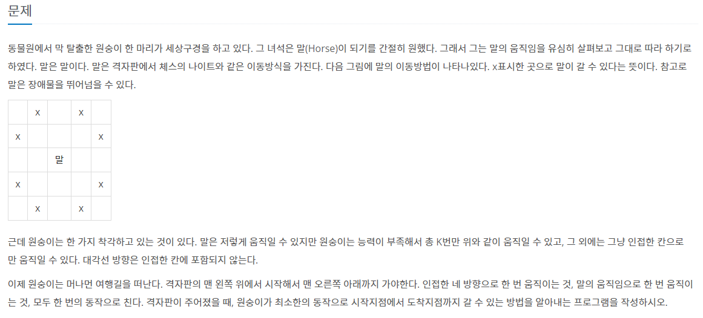
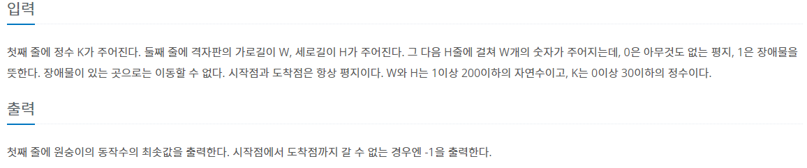

https://www.acmicpc.net/problem/1600

## 문제





### 풀이과정

**일반적인 BFS 문제** 

다만, 말의 능력을 사용할 수 있는 잔여 횟수에 따라 방문처리를 다르게 해줘야 하기 때문에

<span style="color:#2d3748;background-color:#fff5b1">방문처리 함수 visit을 3차원 배열로 선언</span>해서 사용해야했다.


<span style ="background-color:#f1f8ff">[BOJ 7562 나이트의 이동], [BOJ 2206 벽부수고 이동하기]</span>

기존에 풀었던 위 두 문제와 비슷한 유형이었기에 문제를 읽자마자 코딩을 바로 시작할 수 있었다.

하지만 제출과 동시에 계속되는 메모리초과..

​		
​				
​				
​						

나는 순간 3차원 배열을 써서 메모리 초과가 났다고 판단하고

간략하게 3차원 배열의 공간복잡도를 계산해봤다. 200x200x30 =1200KB

하지만, 256MB를 채우기에는 터무니 없었다.

```java
if(cur.k>0) {
				for(int d=0;d<8;d++) {
					int nx=cur.x+dx2[d];
					int ny=cur.y+dy2[d];
					
					if(nx<0||ny<0||nx>=M||ny>=N) continue;
					
					if(!visit[cur.k-1][ny][nx]&&map[ny][nx]==0) {//여기 부분에서 cur.k-1이 아닌 cur.k를 해줘서 메모리 초과가 난거였다
						queue.offer(new CO(nx,ny,cur.k-1,cur.move+1));
						visit[cur.k-1][ny][nx]=true;
					}
				}
			}
```


단순 코딩 실수였다.

초보 코딩러 응애


## 코드 (JAVA 8)

```java
import java.io.BufferedReader;
import java.io.IOException;
import java.io.InputStreamReader;
import java.util.LinkedList;
import java.util.Queue;
import java.util.StringTokenizer;

public class Main {
	//변수 선언
    static int K,M,N;
	static int map[][];
	static boolean visit[][][];
	
    //4방 탐색 선언
    static int dx[]= {1,-1,0,0};
	static int dy[]= {0,0,1,-1};
	
    //체스 8방 탐색 선언
    static int dx2[]= {1,2,2,1,-1,-2,-2,-1};
	static int dy2[]= {-2,-1,1,2,2,1,-1,-2};
	
    //좌표 클래스 선언
	static class CO{
		int x,y,k,move;
		public CO(int x, int y, int k, int move) {
			super();
			this.x = x; //x좌표
			this.y = y; //y좌표
			this.k = k; //점프 가능한 횟수 k
			this.move = move; // 이동한 횟수
		}
	}
	
	public static void main(String[] args) throws NumberFormatException, IOException {
		BufferedReader br = new BufferedReader(new InputStreamReader(System.in));
		//변수 입력
        StringTokenizer st;
		K=Integer.parseInt(br.readLine());
		st=new StringTokenizer(br.readLine());
		M=Integer.parseInt(st.nextToken());
		N=Integer.parseInt(st.nextToken());
		
        //맵 정보 입력
		map= new int[N][M];
		visit=new boolean[K+1][N][M];
		for(int i=0;i<N;i++) {
			st=new StringTokenizer(br.readLine());
			for(int j=0;j<M;j++) {
				map[i][j]=Integer.parseInt(st.nextToken());
			}
		}
        //bfs
		bfs(new CO(0,0,K,0));
	}
	
	static void bfs(CO start){
		Queue<CO> queue = new LinkedList<>();
		queue.offer(start);
		visit[start.k][start.y][start.x]=true;
		
		while(!queue.isEmpty()) {
			CO cur = queue.poll();
			//m-1,n-1에 도착하면 이동 횟수 출력
			if(cur.x==M-1&&cur.y==N-1) {
				System.out.println(cur.move);
				return;
			}
			//인접한 4방 탐색
			for(int d=0;d<4;d++) {
				int nx=cur.x+dx[d];
				int ny=cur.y+dy[d];
				if(nx<0||ny<0||nx>=M||ny>=N) continue;
				if(!visit[cur.k][ny][nx]&&map[ny][nx]==0) {
					queue.offer(new CO(nx,ny,cur.k,cur.move+1));
					visit[cur.k][ny][nx]=true;
				}
			}
			//점프 횟수가 남았을 때 점프 가능한 곳 탐색
			if(cur.k>0) {
				for(int d=0;d<8;d++) {
					int nx=cur.x+dx2[d];
					int ny=cur.y+dy2[d];
					
					if(nx<0||ny<0||nx>=M||ny>=N) continue;
					
					if(!visit[cur.k-1][ny][nx]&&map[ny][nx]==0) {
						queue.offer(new CO(nx,ny,cur.k-1,cur.move+1));
						visit[cur.k-1][ny][nx]=true;
					}
				}
			}
			
		}
        //도착지에 도착하지 못했을 경우
		System.out.println(-1);
	}
	
}
```

