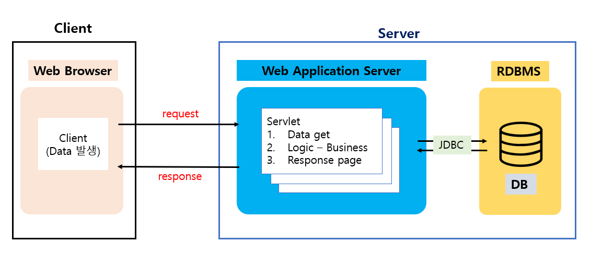
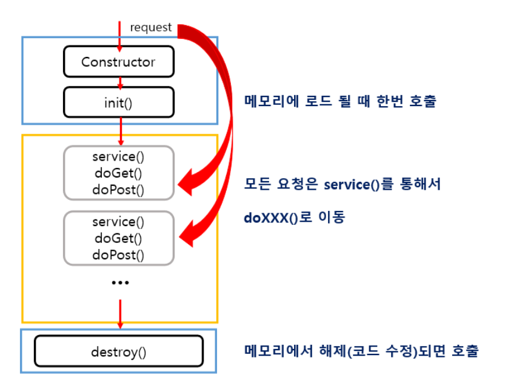

 

###### 🚥  자바 서블릿

- Java를 사용하여 동적으로 **웹페이지를 생성**하는 서버 프로그램
- 웹 서버 성능 향상에 사용되는 자바 클래스의 일종
- JSP와 비슷한 점이 있지만, 서블릿은 **자바 코드 안에 HTML**을 포함하고 있다.

  

###### 🚥 Life-cycle

- Client가 요청하면 Servlet Container가 Servlet 객체를 초기에 한번 생성, 초기화
- 요청에 대한 처리는 요청시마다 반복

  

###### 🚥 파라미터 처리

----------------

- **doGET**
  
  Query String 형식으로 URL에 붙여 데이터 전송 (보안 문제)
  
  간단한 데이터 빠르게 전송 (데이터 양에 제한이 있다 : 2kb)

-----------------

- do**POST**
  
  URL과 별도로 전송, HTTP body에 입력 스트림 데이터로 전달
  
  데이터 제한 x, 최소한의 보안 유지 효과
  
  전달 데이터의 양이 같을 경우 GET보다 느리다 (body에 패킷 구성해야 하므로)

-----------

  
