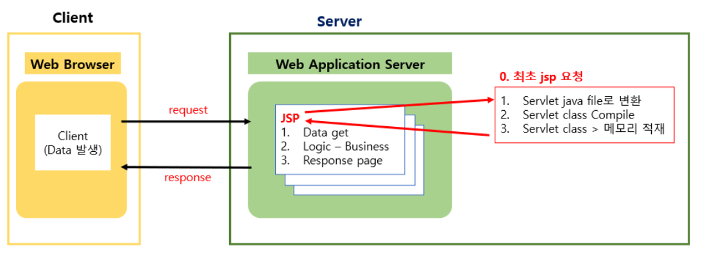
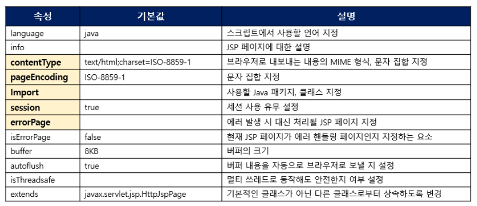

<br>

###### 🚥  JSP 

- Java Server Page
- **HTML 내**에 자바 코드를 삽입한다.
- 자바 서블릿으로 변환된 후 실행
- 서블릿과는 달리 HTML 표준에 따라 작성되므로, 웹 디자인에 용이

<br><br>

###### 🚥 JSP 동작 흐름



<br><br>

###### 🚥 JSP Scriptle

----------------

- **선언 (Declaration)**
  
  멤버변수 선언이나 메소드를 선언하는 영역
  
  ``` java
  <%!
  	String name;
  	public void init(){
     	 name="이재환";
  	}
  %>
  ```
  
  <br>

-----------------

- **스크립트릿 (Scriptlet)**
  
  Client 요청 시 매번 호출, Servlet으로 변환 시 **service()에 해당되는 영역**
  
  request, response에 관련된 코드를 구현한다
  
  ``` jsp
  <%
  	for(int i=1; i<10;i++){
     		out.println("<tr>");
  		for(int j=1;j<10;j++){
      	    out.println("<td class=\""+ "yaho"+"\">" +i+ "</td>");
      	}
      	out.println("</tr>");
  	}
  %>
  ```
  
  <br>

-----------

- **표현식 (Expression)**

  데이터를 브라우저에 출력할 때 사용
  
  <span style="color:red">문자열 뒤 세미클론 작성 x</span>

  ``` jsp
  안녕 <%=name %>!!!
  ```
  
  <br>

--------------------

- **주석 (Comment)**

  코드 상에서 부가 설명 작성
  
  ``` jsp
  <%-- JSP 주석--%>
  ```

<br>


###### 🚥 JSP 지시자

----------------

- **page Directive**

  컨테이너에게 현재 jsp 페이지를 어떻게 처리할 것인가에 대한 정보를 제공한다

  ``` jsp
  <%@ page 속성1 = "val1" 속성2="val2" %>
  ```

  

  <br>

---------

- **include Directive**

  특정 jsp file을 페이지에 포함 

  반복 사용되는 부분을 jsp file로 만든 후 반복되는 코드를 줄일 수 있다

  ``` jsp
  <%@ include file="/template/header.jsp" %>
  ```

  <br>

------------------

- **taglib Directive**

  JSTL 또는 사용자에 의해서 만든 커스텀 태그를 이용할 때 사용

  JSP 페이지 내에 불필요한 자바 코드를 줄일 수 있다.

  ```jsp
  <%@ taglib prefix="c" uri = "http://java.sun.com/jsp/jstl/core"%>
  ```

  

<br>

<br>
