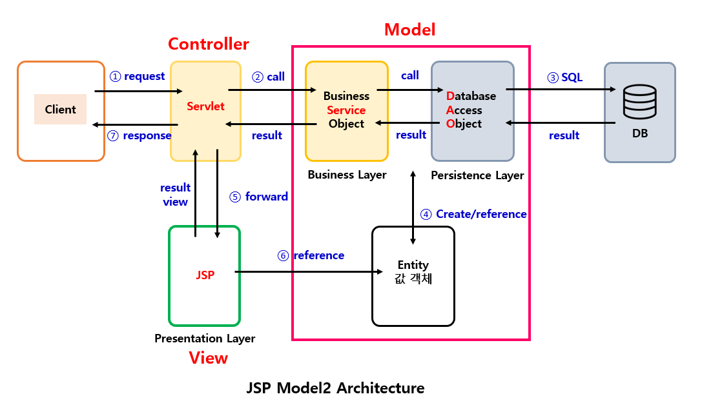

 

###### 🚥 Web Application Architecture

 

 

- JSP를 이용하여 구성할 수 있는 Web Application 구조는 크게 model1과 model2로 나뉜다

-------------

- **Model 1**

  JSP가 client의 요청에 대한 Logic 처리와 view에 대한 처리를 모두 한다.

-----------

- **Model 2**

  MVC(Model-View-Controller) 패턴을 Web 개발에 도입한 구조

  JSP가 view에 대한 처리만 한다

------------

 

###### 🚥 Model 1

- model1은 view와 logic을 JSP 페이지 하나에서 처리하는 구조

- client로부터 요청이 들어오게 되면 JSP 페이지는 java beans나 별도의 service class를 이용하여 작업을 처리하고 결과를 client에 출력한다

-------------

- **장점**
  - 구조가 단순하며 직관적
  - 개발 시간이 비교적 짧기 때문에 개발 비용 감소

---------------

- **단점**
  - 출력을 위한 view 코드와 로직 처리를 위한 java 코드가 섞여 있기 때문에 복잡하다
  - 확장성이 나쁘다
  - 분업, 유지보수가 어렵다

------------

  

###### 🚥 Model 2

- Model-View-Controller MVC 패턴
- Controller : client 요청에 대한 처리는 Servlet
- Model : Logic 처리는 Java class ( Service, Dao ) or Java Beans  
- View : client에게 출력하는 response page는 JSP

-------------

- **장점**
  - Model 1에 비해 코드가 복잡하지 않다
  - 화면단과 Logic단이 분리되었기에 분업, 유지보수 용이
  - 확장성 뛰어나다

---------------

- **단점**
  - 구조가 복잡하여 초기 진입이 어렵다
  - 개발 시간의 증가로 개발 비용 증가
