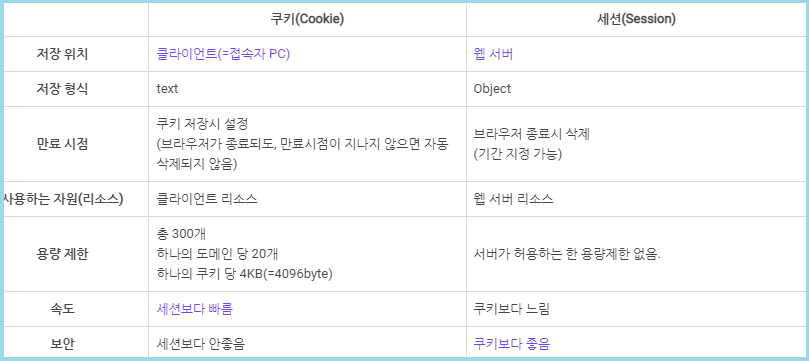

 

###### 🚥 HTTP 프로토콜 특징

- **Connectionless (비연결지향)**
  - Client : Server에 요청 
  - Server : 요청 처리 후 Client 응답
  - 응답 후 연결 해제 

-------------

- **Stateless (상태정보 유지 X)**
  - 클라이언트의 상태 정보를 유지하지 않는 서버 처리 방식
  - 클라이언트와 데이터를 주고 받았다 해도, 이전 데이터를 유지하지 않는다

-----------

 

**→ HTTP 프로토콜의 특징이자 약점을 보완하기 위해서 Cookie & Session 사용**

  

###### 🚥 Cookie & Session

 

 

---------

- 공통점 
  - 웹 통신 간 클라이언트 **상태 정보**를 **유지**하기 위해 사용
  - Map 형식으로 관리하기 때문에 key 값의 중복을 허용하지 않는다

---------

- 차이점 : Cookie (**개인 PC**에 저장), Session(**웹 서버**에 저장)

​			

 

###### 🔔  Question

--------------

**Q. 비교적 많은 장점을 가진 Session을 쓰면 되는데 왜 Cookie를 왜 쓰는걸까?**

-------------

**A**. Session은 서버 자원을 사용하기 때문에 사용자가 많을 수록 서버 자원 소모가 심하다.

Cookie와 Session을 적절히 병행 사용하면 서버 자원 낭비를 방지할 수 있고 웹 속도 또한 향상시킬 수 있다.

  
