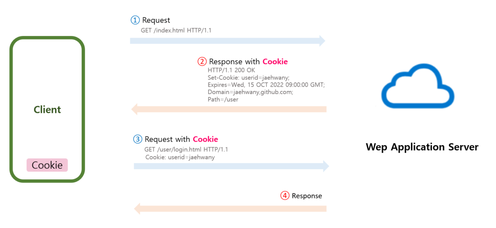

<br>

###### 🚥 Cookie

- **사용자의 컴퓨터**에 저장되는 **<span style="color:red">Key, Value</span>**이 들어 있는 작은 데이터 파일
- Response Header에 **Set-Cookie** 속성을 사용하면 클라이언트에 쿠키를 만들 수 있다
- 사용자가 따로 요청하지 않아도 브라우저가 request시 Request Header를 넣어서 자동으로 서버에 전송
- 브라우저마다 저장되는 쿠키는 다르다 (서버에서는 브라우저가 다르면 다른 사용자로 인식)


<br>

<br>

###### 🚥 Cookie  구성 요소

- **구성**
  - **이름** (name) : 쿠키를 구별하는 데 사용되는 이름
  - **값** (value): 쿠키의 이름과 매핑되는 값
  - **유효기간** (expires): 쿠키의 유효 기간
  - **도메인** (domain) : 쿠키를 전송할 도메인
  - **경로** (path) : 쿠키를 전송할 요청 경로
  
  ``` jsp
  Set-Cookie: name=value; expiers=date; path=path; domain=domain; secure
  ```
  
  


----------

- **크기**
  - client에 총 **<span style="color:red">300</span>**개의 쿠키를 저장할 수 있다
  - 하나의 **도메인당 <span style="color:red">20개</span>**의 쿠키를 가질 수 있다
  - 하나의 쿠키는 <span style="color:red">**4KB**</span>까지 저장 가능하다


<br><br>

###### 🚥 Cookie의 사용 목적

- **세션관리** 
  - User ID, 접속 시간, 장바구니 등 서버가 알아야 할 정보 저장
  - ex) ID 저장 (자동 로그인), 일주일간 다시 보지 않기, 쇼핑몰 장바구니 기능
- **개인화**
  - 사용자에 맞는 Page를 보여줄 수 있다
- **트래킹**
  - 사용자의 행동과 패턴 분석, 기록
  - ex) 최근 검색한 상품 광고에 추천

-----------

<br>

<br>

###### 🚥 Cookie의 동작 순서



<br>

- Client가 페이지를 <span style="color:#2d3748;background-color:#fff5b1">**Request**</span>

- WAS에서 <span style="color:#2d3748;background-color:#fff5b1">**Cookie 생성**</span> & HTTP Header에 Cookie를 넣어 **<span style="color:#2d3748;background-color:#fff5b1">응답</span>**

- 브라우저는 받은 **Cookie를 <span style="color:#2d3748;background-color:#fff5b1">PC(local)에 저장</span>** 

- 같은 요청을 할 경우 HTTP 헤더에 쿠키를 함께 보냄

- 브라우저가 종료되어도 <span style="color:#2d3748;background-color:#fff5b1">**Cookie 만료 기간이 남아 있다면 Client는 계속 보관**</span>

-  WAS에서 Cookie를 읽어 이전 상태 정보를 변경 필요가 있을 때 업데이트한 Cookie를 HTTP 헤더에 포함시켜 응답

<br>

<br>

###### 🚥 Cookie의 주요 기능

------

- **Cookie 생성**

  ``` java
  Cookie cookie = new Cookie(String name, String value);
  
  //값 설정
  cookie.setValue(String value);
  
  //도메인 지정
  cookie.setDomain(String domain);
  
  //경로 설정
  cookie.setPath(String path);
  
  //유효기간 설정
  cookie.setMaxAge(int expiry);
  
  //생성된 cookie를 client에 전송
  response.addCookie(cookie);
  ```

----------

- **Cookie 얻기**

  ```java
  //Client에 저장된 모든 Cookie 얻기
  Cookie cookies[]= request.getCookies();
  
  //값 얻기
  String value = cookie[i].getValue();
  
  //도메인 얻기
  String domain = cookie[i].getDomain();
  
  //경로 얻기
  String path = cookie[i].getPath();
  
  //유효기간 얻기
  int expiry = cookie[i].getMaxAge();
  ```

----------

- **원하는 쿠키 검색**

  ```java
  //원하는 쿠키 이름으로 검색
  String name = cookies[i].getName();
  if( name.equals(“id”) ) { … }
  ```

----------

- **쿠키 삭제**

  ```java
  //Cookie 삭제
  cookie.setMaxAge(0);
  
  //수정된 cookie를 client에 전송
  response.addCookie(cookie);
  ```

----------

