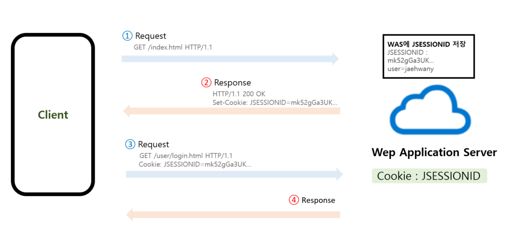

<br>

###### 🚥 Session

- User가 웹 서버에 <span style="color:red">**접속**</span>해 있는 상태
- 브라우저가 종료되기 전까지 **클라이언트의 요청을 유지**하게 해주는 기술
- 쿠키를 기반하고 있지만, 사용자 정보 파일을 브라우저에 저장하는 쿠키와 달리 **서버**에서 **관리**한다

<br><br>


###### 🚥 Session의 특징

- 웹 브라우저 상태를 **유지**하기 위한 정보를 **<span style="color:red">서버</span>**에 저장

- 각 클라이언트에게 **<span style="color:red">고유 세션 ID를 부여</span>**하여 클라이언트의 요구에 맞는 서비스를 제공

- 서버 메모리에 Object의 형태로 저장되고, <span style="color:#2d3748;background-color:#fff5b1">**저장 데이터에 제한이 없다**</span>

  → 사용자가 많아질수록 서버 메모리를 많이 차지하게 됨

- 브라우저를 닫거나, 서버에서 세션을 삭제 했을 때만 삭제된다

- 사용자 정보를 서버에 저장하기 때문에,  쿠키보다 비교적 보안이 좋다

<br><br>

###### 🚥 Session의 사용 예

- 화면을 이동해도 로그인(사용자 정보)이 풀리지 않고 유지
- 장바구니

<br>

<br>

###### 🚥 HttpSession의 동작 순서



<br>

- 클라이언트가 페이지 <span style="color:#2d3748;background-color:#fff5b1">**Request**</span>

- 서버는 클라이언트의 Request-Header 필드인 Cookie를 확인하여, 클라이언트가 해당 session-id를 보냈는지 확인

- session-id가 존재하지 않는다면, <span style="color:#2d3748;background-color:#fff5b1">**session-id 생성**</span> 후 클라이언트에 응답

- 클라이언트는 이후 서버에 요청할 때 전달받은 session-id 쿠키를 **<span style="color:#2d3748;background-color:#fff5b1">자동으로 Request-Header에 추가</span> 후 Request**

- 서버에서는 Request-Header의  **session-id 값**을 <span style="color:#2d3748;background-color:#fff5b1">저장된 세션 저장소에서 찾아보고</span> 유효한지 확인 후 처리 후 응답


<br>

<br>

###### 🚥 HttpSession의 주요 기능

------

- **생성**

  ``` java
  HttpSession session = request.getSession();
  HttpSession session = request.getSession(false);
  ```

------

- **값 저장/얻기**

  ```java
  //값 저장
  session.setAttribute(String name, Object value);
  
  //값 얻기
  Object obj = session.getAttribute(String name);
  ```

----------

- **값 제거**

  ```java
  //특정 이름의 속성 제거(해당 세션 끊기)
  session.removeAttribute(String name);
  
  //binding되어 있는 모든 속성 제거(모든 세션 끊기)
  session.invalidate();
  ```

----------

- **생성시간**

  ```java
  long ct = session.getCreationTime();
  ```

----------

- **마지막 접근 시간**

  ```java
  long lat=session.getLastAccessedTime();
  ```

----------

<br><br>
