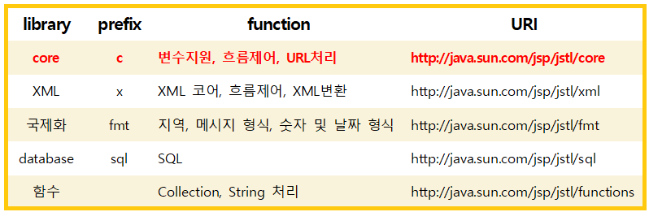
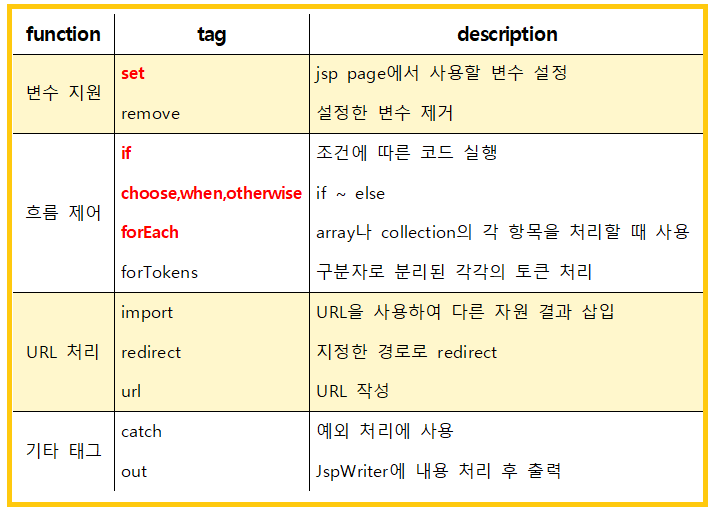

<br>

###### 🚥 JSTL (JSP Standard Tag Library)

- Jave EE 기반 웹 어플리케이션 개발 플랫폼을 위한 컴포넌트 모음
- **custom tag** : 사용자 정의 태그 
- **JSTL** : custom tag 중 많이 사용되는 것들을 모은 것
- 논리적인 판단, 반복문의 처리, 데이터베이스 처리 가능
- JSTL에는 다양한 액션이 있으며, EL과 함께 사용하여 코드를 간결하게 작성할 수 있다

<br><br>


###### 🚥 JSTL Tag

- directive 선언 형식 : <span style="color:blue"><%@ taglib prefix="prefix" uri = "uri" %></span>

  

<br><br>

###### 🚥 JSTL - core tag

- 선언 형식 : <span style="color:blue"><%@ taglib prefix="c" uri="http://java.sun.com/jsp/jstl/core"%></span>

  

  <br>

-------------------

- **변수 선언 : <c: set>**

  - 변수나 특정 객체의 프로퍼티에 값을 할당할 때 사용

  - 변수 값 할당 : / **var** : 변수 / **value** : 값 설정 / **scope** : 변수 생존 범위 (default : page)

  - 특정 객체 프로퍼티 값 할당 : / **target**  : 객체 설정 / **property** : 프로퍼티명 설정 / **value** : 값 설정

    <br>

    ```java
    //value 속성을 이용하여 생존범위 변수 값 할당
    <c:set var="varName" value="value" scope="{page|request|session|application}"/>
    ```
  
    
    
    ```java
    //액션의 Body 컨텐츠를 사용하여 생존범위 변수 값 할당
    <c:set var="varName" scope="{page|request|session|application}">
    body content
    </c:set>
    ```
    
    ```java
    //액션의 Body 컨텐츠를 사용하여 대상 객체의 프로퍼티 값 할당
    <c:set target="target" property="propertyName">
    body content
    </c:set>
    ```
    
    
  
  <br>

---------

- **출력 : <c: out>**

  - 변수 값 할당 :  **var** : 변수 

    <br>

    ```jsp
    //var 속성을 출력한다
    <c:out var=""/>
    ```


  <br>

-----------

- **예외 : <c: catch>**

  - JSP 페이지는 <span style="color:red">예외</span>가 발생하면 지정된 오류페이지를 통해 처리

  - **<c: catch>**는 예외가 발생할 만한 코드를 오류페이지로 넘기지 않고 **직접 처리**할 때 사용

  - **var**  : 발생한 예외를 담을 page 생존범위 변수 지정

  - <c: catch>와 <c: if>를 함께 사용하여 try~catch와 같은 기능 구현할 수 있다

    <br>

    ```java
    //try ~ catch 구문
    try{
        String str=null;
        out.println("Length of string : " +str.length());
    } catch(Throwable e){
        out.print(e.getMessage());
    }
    ```

    ```java
    //<c:catch>와 <c:if> 사용한 try ~ catch 구문
    <%@ page contentType="text/html" pageEncoding="UTF-8" errorPage="error.jsp" %>
    <%@ taglib prefix="c" uri="http://java.sun.com/jsp/jstl/core"%>
        
    <c:catch var="e">
    <%
        String str=null;
    	out.println("Length of string : " + str.length());//예외발생~!!
    %>
    </c:catch>
    
    <c:if test="${e !=null}">
        예외가 발생하였습니다. ${e.message}
    </c:if>
    ```

    <br>

-----------

- **조건문: <c: if>, <c: choose><c: when><c: otherwise>**

  - **test** : 지정된 표현식이 true이면 Body 컨텐츠 수행

  - **var**  : 표현식의 평가 결과인 Boolean 값을 담을 변수

  - **scope** : 변수의 생존범위 설정

    <br>

    ```java
    //<c:if> 액션의 var 속성
    <c:if test="${userType eq 'admin'}" var="accessible" >
        <jsp:include page= "admin.jsp" />
    </c:if>
    ```

    ```java
    //<c:choose><c:when><c:otherwise>
    <c:choose>
        <c:when test ="${userType == 'admin'}">
            관리자 화면..
        </c:when>
        <c:when test ="${userType == 'member'}">
            회원 사용자 화면..
        </c:when>
        <c:otherwise>
            일반 사용자 화면..
        </c:otherwise>
    </c:choose>
    ```

    <br>

--------

- **조건문: <c: forEach>**

  - 컬렉션에 있는 항목들에 대하여 Body 컨텐츠를 반복 수행

  - 컬렉션에는 Array, Collection, Map 또는 콤마로 분리된 문자열이 올 수 있다

  - **var** : 반복에 대한 현재 항목을 담는 변수

  - **items**  : 반복할 항목들을 갖는 컬렉션

  - **varStatus** : 현재 반복 상태를 알 수 있다

    <br>

    ```java
    <c:forEach var="course" items="${courses}" varStatus="varStatus">
        ${varStatus.count}. ${course.name}<br/>
    </c:forEach>
        
    <c:forEach var="course" items="${courses}" begin="0" end="5" step="2">
        ${course.name}<br/>
    </c:forEach>
        
    <c:forEach var="value" begin="1" end="5" step="1">
        ${value}<br/>
    </c:forEach>
    ```

    

<br><br>
