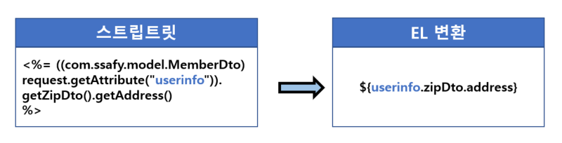
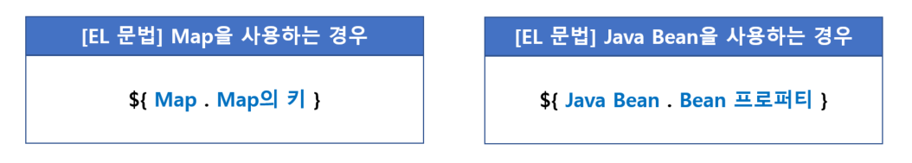
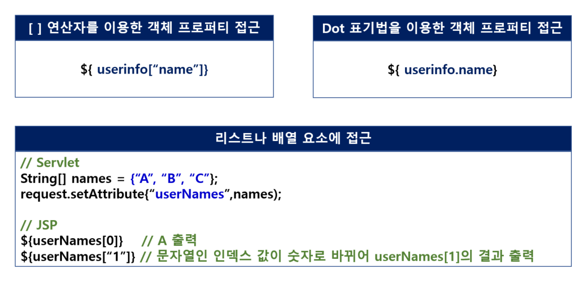

 

###### 🚥 EL (Expression Language)

- JSP 스크립트의 표현식을 대신하여 속성 값을 **쉽게** 출력하도록 고안된 language

-------

- 표현식(<%= %>) 대체

- EL 표현식에서 도트 연산자 **왼쪽**은 반드시 **java.util.Map 객체** 또는 **Java Bean 객체**
- EL 표현식에서 도트 연산자 **오른쪽**은 반드시 **Map의 키**이거나 **Bean 프로퍼티**

  

###### 🚥 EL 문법

- pageContext를 제외한 모든 EL 내장 객체는 **Map**,  **(key, value)**의 쌍으로 값 저장

 

--------

- **EL 변환**

  

 

-----------------

- **Dot 표기법**

  

 

-------------------

- **[  ] 연산자**

  - EL에는 [  ] 연산자를 사용하여 객체의 값에 접근할 수 있다
  - [  ] 연산자 안의 값이 문자열인 경우, 이것은 **Map의 키** or **Bean 프로퍼티나 리스트 및 배열의 인덱스**가 될 수 있음
  - 배열과 리스트인 경우, 문자로 된 인덱스 값은 숫자로 변경하여 처리

  

  

###### 🚥 EL Operator (연산자)

- 대부분 java와 동일
- **산술** : +, -, *, /(div), %(mod)
- **관계형** : ==(eq),  !=(ne),  <(lt),  >(gt),  <=(le),  >=(ge)
- **3항 연산** : 조건 ? 값1 : 값2
- **논리** : &&(and),  ll(or),  !(not)
- **타당성검사** : empty
- **empty 연산자에서 true를 return하는 경우** → ${empty var}
  - 값이 null
  - 값이 빈 문자열(" ")
  - 길이가 0인 배열 []
  - 빈 Map 객체
  - 빈 Collection 객체

  

