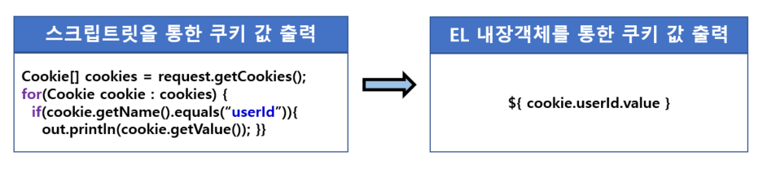

<br>

###### 🚥 EL 내장 객체

- **pageContext**
  - Type : Java Bean
  -  현재 페이지의 프로세싱과 상응하는 pageContext instance

-----------

-----

- **pageScope**
  - Type : Map
  - page scope에 저장된 객체 추출

- **<span style="color:red">requestScope</span>**
  - Type : Map
  - request scope에 저장된 객체 추출

- <span style="color:red">**sessionScope**</span>
  - Type : Map
  - session scope에 저장된 객체 추출

- **applicationScope**
  - Type : Map
  - application scope에 저장된 객체 추출

---------------

---------

- <span style="color:red">**param**</span>
  - Type : Map
  - **ServletRequest.getParameter(String)**을 통해 요청 정보 추출

- **paramValues**
  - Type : Map
  - ServletRequest.getParameterValues(String)을 통해 요청 정보 추출

------------------

---------

- **header**
  - Type : Map
  - HttpServletRequest.getHeader(String)을 통해 헤더 정보 추출

- **headerValues**
  - Type : Map
  - HttpServletRequest.getHeaderValues(String)을 통해 헤더 정보 추출

---------

---------

- <span style="color:red">**cookie**</span>
  - Type : Map
  - **HttpServletRequest.getCookies()**을 통해 쿠키 정보 추출

------------

----

- **initParam**
  - Type : Map
  - ServletContext.getInitParameters(String)을 통해  초기화 파라미터 추출

<br>

<br>


###### 🚥 EL 객체 접근

- **request.setAttribute(<span style="color:blue">"userinfo","jaehwany"</span>);**

  ``` java
  ${requestScope.userinfo}
  ${pageContext.request.userinfo}, ${userinfo} 
  ```

  property만 쓰면 **pageScope > requestScope > sessionScope > applicationScope** 순으로 객체 찾음
  
  <br>

------------

- **url?name=<span style="color:blue">jaehwany</span>&fruit=<span style="color:blue">사과</span>&fruit=<span style="color:blue">바나나</span>**

  ```java
  ${param.name}
  ${paramValues.fruit[0]}. ${paramValues.fruit[1]}
  ```
  
  <br>

---

- **EL에서 request 객체 접근**

  ```java
  Method is : ${pageContext.request.method}
  
  //Servlet
  request.setAttribute("jaehwany.user",memberDto);
  
  //error case
  ${jaehwany.user.name} // jaehwany라는 속성 존재 x
  
  //correct case
  ${requestScope["jaehwany.user"].name}
  ```
  
  <br>

---

- **${cookie.id.value}**

  - **cookie**가 null이면 null return, null이 아니라면 **id 검사**
  - **id**가 null이면 null return, null이 아니라면 **value 검사**

  

  - EL은 값이 null이라도 null을 출력하지 않는다 → 공백 출력
  
  <br>

-----------------

- **EL 객체 method 호출**

  ``` java
  <%
  List<MemberDto> list = dao.getMembers();
  request.setAttribute("users",list);
  %>
      
  //회원 수
  ${requestScope.users.size()},  ${users.size()}
  
  //**주의**
  ${users.size}  == <%=request.getAttribute("users").getSize() %>
  ```

<br><br>


