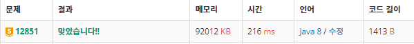

<br>

# ✔️ Problem  : [숨바꼭질2](https://www.acmicpc.net/problem/12851)

<br>

###### 💡 풀이 과정

******************************************************************

BFS 문제

기존의 BFS 문제는 중복처리를 위해 다음 행선지에 대한 방문처리를 queue에 넣기전에 해줘야했다. <br>

하지만, 이 문제는 가능한 모든 가짓수를 구해야하는 문제이기에 <br>

<span style="color:#2d3748;background-color:#fff5b1">방문처리를 queue에 넣기전이 아닌 queue에서 꺼낼 때 </span>해주어야 했다.

```java
while(!queue.isEmpty()) {
	Info cur = queue.poll();
	visit[cur.p]=true;
```

<br>

-----------------------

##### ▪ 인접 탐색

 앞, 뒤, 순간이동에 해당하는 탐색은 다음과 같이 구현하였다.

```java
//앞,뒤,순간이동
for(int d=0;d<3;d++) {
	int next=0;
	if(d==0) next=cur.p-1;
	else if(d==1) next=cur.p+1;
	else if(d==2) next=cur.p*2;
```

<br>

-------------------

##### ▪ 도착시간 구하기

BFS로 최초 도착시간 구한 후, 최초 도착시간으로 도착하는 모든 경우에 대해서 count를 해준다

```java
//최초 도착시간 + 몇 번 도착하는지 
if(next==K) {
	time=Math.min(time, cur.time+1);
	if(time==cur.time+1) cnt++;
	continue;
}
```

<br>

--------------------

##### ▪ 결과


<br><br>

###### 📃 코드(java 8)

```java
import java.io.BufferedReader;
import java.io.IOException;
import java.io.InputStreamReader;
import java.util.LinkedList;
import java.util.Queue;
import java.util.StringTokenizer;

public class Main {
	static int num=100000;
	static int N,K;
	static int time=Integer.MAX_VALUE;
	static int cnt;
    
	//Info 클래스 선언
	static class Info{
		int p,time;
		public Info(int p, int time) {
			super();
			this.p = p;
			this.time = time;
		}
	}
	public static void main(String[] args) throws IOException {
		BufferedReader br = new BufferedReader(new InputStreamReader(System.in));
		StringTokenizer st = new StringTokenizer(br.readLine());
		N=Integer.parseInt(st.nextToken());
		K=Integer.parseInt(st.nextToken());
	
		//처음부터 위치가 같다면
		if(N==K) {
			System.out.println(0);
			System.out.println(1);
			return;
		}
        
		bfs();	
		System.out.println(time);
		System.out.println(cnt);
	}
	//BFS
	static void bfs() {
		boolean visit[]=new boolean[num+1];
		Queue<Info> queue=new LinkedList<>();
		queue.offer(new Info(N,0));
		while(!queue.isEmpty()) {
			Info cur = queue.poll();
			visit[cur.p]=true;
			//앞,뒤,순간이동
			for(int d=0;d<3;d++) {
				int next=0;
				if(d==0) next=cur.p-1;
				else if(d==1) next=cur.p+1;
				else if(d==2) next=cur.p*2;
				
				if(next<0||next>100000||visit[next]) continue;
				
				//최초 도착시간 + 몇 번 도착하는지 
				if(next==K) {
					time=Math.min(time, cur.time+1);
					if(time==cur.time+1) cnt++;
					continue;
				}
				queue.offer(new Info(next,cur.time+1));
				
			}
		}
	}
	
}

```

