<!-- ---
layout: single
title:  "dp1"
categories: BOJ
tags: [BFS, Gold]
toc: true
toc_sticky: true
author_profile: false
sidebar:
    nav: "docs"
search: false
--- -->

<br>

<br>

###### ✔ 피보나치 수를 구하는 재귀함수 

: 함수, 메소드의 역할(정의)를 명확히!, Flat!

- fibo(n) : 피보나치 수열의 n항을 계산																																																																																																																																																																																																																																																																																																																										

-> 문제점이 있음 / 엄청난 중복 호출이 존재


피보나치 수열의 call tree: 상태 공간 트리


같은 input 에 같은 output을 보장해야 재사용이 가능함 

-> 재사용이 가능하다면 중복호출 없이 메모이제이션 활용


###### ✔메모이제이션

- 이전에 계산한 값을 메모리에 저장해서 매번 다시 계산하지 않도록 하여 전체적인 실행속도를 빠르게 하는 기술. 동적 계획법의 핵심
- memorization과 혼동/ memoization : 메모리에 넣기 
- 값을 바로 저장하면 실행시간을 o(n)으로 줄일 수 있음


``` java
1. memo를 위한 배열 할당 -> 1차원,2차원,그 밖의 자료구조가 될 수 있음
2. 모두 0으로 초기화-> (메모되어 있는 값인지(실행 후 계산된값?) 아닌지 구분하기 위해 초기화)
f0 =0, f1=1  /n>=2이고 memo[n]=0(-1로 초기화하면 n>=2 뺄 수 있음)
```

✔동적계획법

- 그리디 알고리즘과 같이 최적화 문제, ''경우의수를 구하는 문제(ex, nCr)''를 해결하는 알고리즘
- 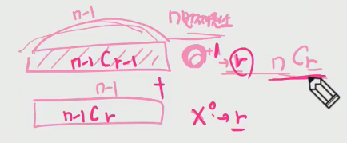
- 먼저 작은 부분 문제들의 해를 구하고, 이것을 이용하여 큰 크기의 부분문제들을 해결하여, 최종적으로 주어진 문제를 해결하는 알고리즘

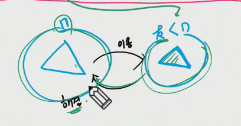

1. 큰 크기문제를 작은 크기 문제로 생각해보기
2. 큰 크기 문제 해결방법이 작은 크기문제 해결방법에 동일하게 적용 가능한지?
3. 재귀(하향식)를 스마트하게 상향식으로 바꾸면 dp?


- 동적 계획법을 적용하려는 문제는 다음과 같은 요건 필요
  - 중복 부분문제 구조(Overlapping subproblems)
  - 최적 부분문제 구조(Optimal substructure) -> 나의 최적해를 구하기위해 부분문제의 최적해를 구하는 구조


- 최적 부분문제 구조

  최적화의 원칙을 만족해야만 동적 계획법을 효율적으로 적용할 수 있다.

​		최적화의 원칙 : 어떤 문제에 대한 해가 최적일 떄, 그 해를 구성하는 작은 문제들의 해 역시 최적이어야 한다

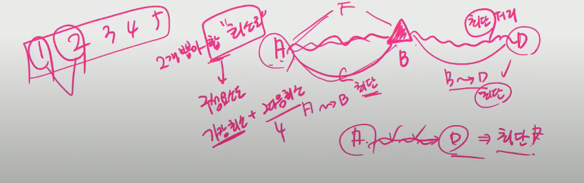


- 중복 부분문제 구조

​	dp 는 큰 문제를 이루는 작은 문제들을 먼저 해결하고 작은 문제들의 최적 해를 이용하여 순환적으로 큰 문제를 해결한다. 점화석을 사용

dp는 문제의 순환적인 성질(점화식) 때문에 이전에 계산되어졌던 작은 문제의 해가 다른 어딘가에서 필요하게 되는데 이를 위해 dp에서는 이미 해결된 작은 문제들의 해들을 어떤 저장 공간(table)에 저장하게 된다(memoization)

이렇게 저장된 해들이 다시 필요할 때마다 해를 얻기 위해 재계산하지 않고 table의 참조를 통해서 중복된 계산을 피하게 된다.


- 최적의 원칙이 적용되지 않는 예 : 최장경로 문제
  - 최적의 원칙이 적용되지 않는다

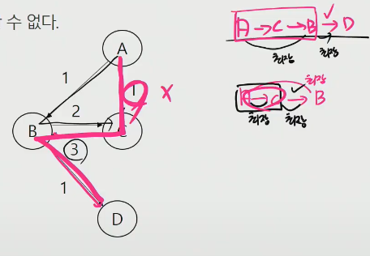


- 분할정복 vs dp
  - 분할정복
    - 연관 없는 부분 문제로 분할(의존적 관계 x)
    - 부분 문제를 재귀적으로 해결
    - 부분문제의 해를 결합 (ex 병합정렬, 퀵정렬)
    - 하향식 방법
    - 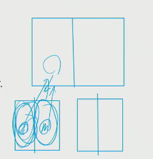
  - dp
    - 부분 문제들이 연관이 없으면 적용할 수 없음(부분 문제들은 더작은 부분 문제들을 공유)
    - 모든 부분 문제를 한번만 계산하고 결과를 저장, 재사용
    - 상향식 방법
    - 부분 문제들 사이에 의존적 관계

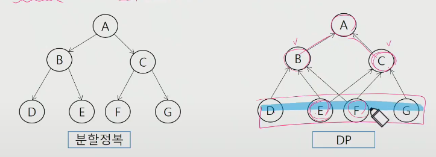


- dp 적용 접근 방법

1. 최적해 구조 특성 파악 

​		문제를 부분문제로 나눈다

2. 최적해의 값을 재귀적으로 정의

​		부분 문제의 최적해 값에 기반하여 문제의 최적해 값 정의 ->"점화식"

3. 상향식 방법으로 최적해의 값을 계산

​	가장 작은 부분문제부터 해를 구한 뒤 테이블에 저장

​	테이블에 저장되어 있는 부분 문제 해 이용하여 점차적으로 상위 부분문제 최적해 구함(상향식)


- 피보나치 dp 적용 알고리즘

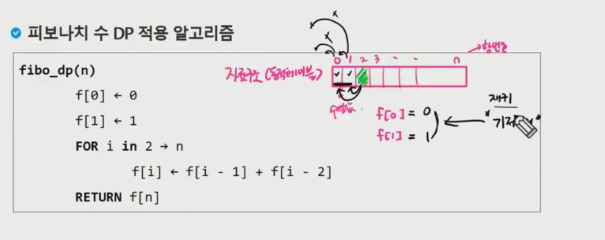


 1.시작값 : 재귀의 "기저조건"

2. 기저 조건 다음항 상향식

``` java
public class DP1_FibonacciTest {
	
	public static void main(String[] args) throws NumberFormatException, IOException {
		BufferedReader br = new BufferedReader(new InputStreamReader(System.in));
		int n= Integer.parseInt(br.readLine());
		
		long[] D= new long[n+1];//동적테이블 생성
		//기저조건(베이스 값 채우기)
		D[0]=1;
		D[1]=1;
		
		for(int i=2; i<=n; i++) { //점화식을 이용하여 상향식으로 동적테이블 채우기
			D[i]=D[i-1]+D[i-2];
		}
		System.out.println(D[n]);
	}

}
```


- 동전 거스름 돈 구하기

  - 동전의 종류 1,4,6원

  - 8원을 거슬러주려 한다. 최소 몇개의 동전을 거슬러 주면 되나?

그리디 방법 ? ->항상 최적해를 구하는 것은 아니다

--> dp로 접근


- 우선 재귀적인 접근 (하향식)

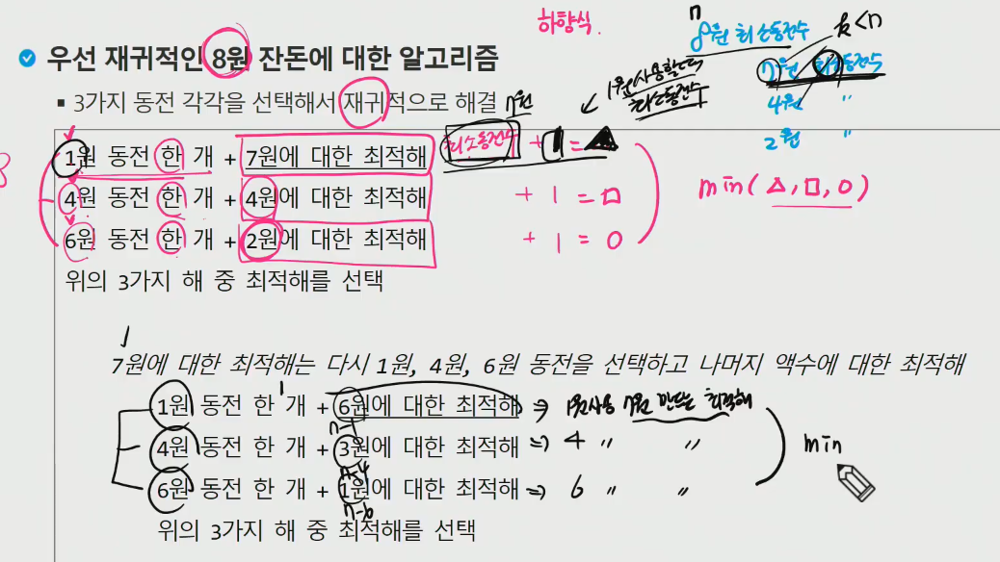

n원 최소 동전수 -> n-1 최소 동전수 +1

​								n-4 최소 동전수 +1

​								n-6 최소 동전수+1    -> 이 3개 중에 min

​              -> 최적 부분문제


- Call tree 상태공간 트리

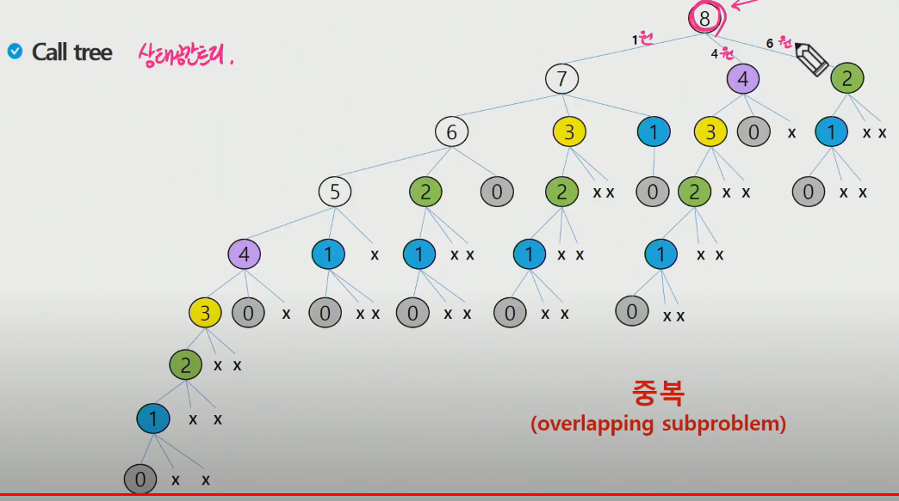


-> 중복 부분문제


--> dp 적용 가능


- dp 접근 : 상향식

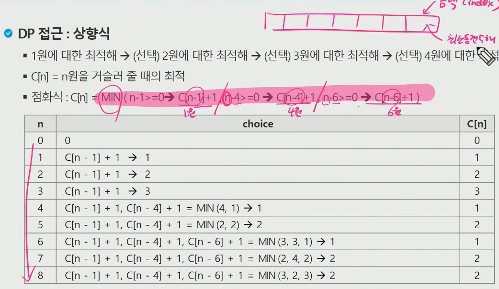


``` java
import java.io.BufferedReader;
import java.io.IOException;
import java.io.InputStreamReader;

public class BOJ_1463_1로만들기 {
	public static void main(String[] args) throws NumberFormatException, IOException {
		BufferedReader br = new BufferedReader(new InputStreamReader(System.in));
		int N= Integer.parseInt(br.readLine());
		int[] D= new int[N+1];
		D[0]=0; //0원을 만드는 최소동전개수는 0
		for(int i=1;i<=N;i++) {
			//1,4,6원을 각각 사용했을때의 최소동전개수 중 가장 최적해(최소값)
			int min = Integer.MAX_VALUE;
			if(i>=1) min=Math.min(min, D[i-1]+1);
			if(i>=4) min=Math.min(min, D[i-4]+1);
			if(i>=6) min=Math.min(min, D[i-6]+1);
			
			D[i]=min;
		}
		System.out.println(D[N]);
	}
}
```


- 문제 제시 : 계수 값 구하기
- 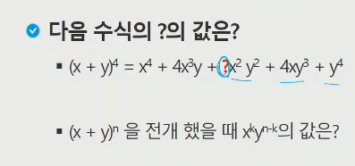


- 문제 제시 : knapsack
- 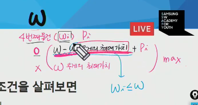

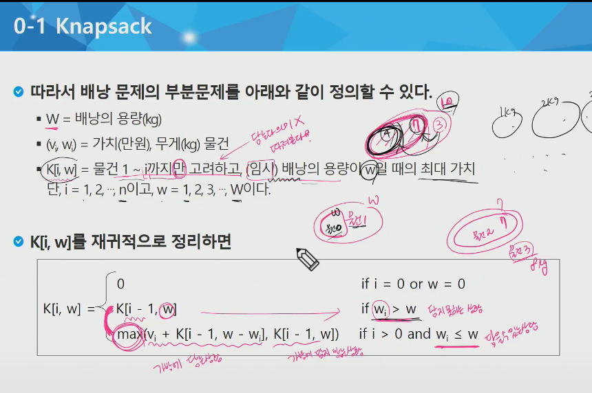