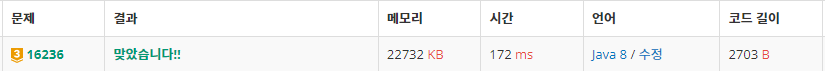

<br>

# ✔️ Problem  : [아기 상어](https://www.acmicpc.net/problem/16236)

<br>


###### 💡 풀이 과정

******************************************************************

**시뮬레이션 + BFS + 우선순위 큐**

신경써야 할 조건이 많아서 풀이하는데 시간을 많이 소요한 문제다

거리가 가장 가까운 물고기를 구하는 것을 보고 **<span style="color:#2d3748;background-color:#fff5b1">BFS</span>**를 선택했고 

우선순위를 따지는 부분이 있어서 **<span style="color:blue">우선순위 큐</span>**를 이용했다

최종 코드를 봤을 때는 진짜 별 거 없는 데, 구현할 때는 엄청 애를 많이 먹었다 ㅠㅠ


-------------------

문제의 흐름은 다음과 같았다

1. 먹을 수 있는 물고기 찾기 (BFS)
2. 먹을 수 있는 물고기가 없다면 엄마 상어 호출
3. 먹을 수 있는 물고기가 있다면 물고기 찾아가서 먹기

🠖 먹을 수 있는 물고기가 없을 때까지 1,2,3을 반복  (while)

```java
int eat_count =0;
while(true){
	//1. 먹을 수 있는 물고기 찾고, 우선순위 큐에 물고기 저장
	bfs(shark);
		
	//2. 먹을 수 있는 물고기가 없으면 엄마 상어 호출
	if(pq.isEmpty()) {
		System.out.println(time);
		return;
	}
    
	//3. 먹을 수 있는 물고기가 있다면 물고기 찾아가서 먹기	
	CO cur = pq.poll();	//물고기 찾아가기
	time+=cur.distance;	//찾는데 걸린시간
	
	//물고기 먹기
	//물고기를 먹으면 그 칸은 빈 칸이 되고
	//자신의 크기와 같은 수의 물고기를 먹을 때 마다 크기가 1 증가
	map[cur.y][cur.x]=0;	
	if(++eat_count==shark.size) {
		shark.size++;
		eat_count=0;
	}
	//아기 상어 상태 최신화
	shark=new CO(cur.y,cur.x,shark.size,0);			
	pq.clear(); 	//물고기 list 비우기
}
```

<br>

-----------------------

##### ▪ BFS (먹을 수 있는 물고기 찾기)

<span style="color:#2d3748;background-color:#fff5b1">4방 탐색</span>을 이용하여 공간 전체를 탐색하여 먹을 수 있는 물고기를 찾아낸다

먹을 수 있는 물고기는 <span style="color:#2d3748;background-color:#fff5b1">우선 순위 큐</span>에 넣어서 우선 순위를 정해준다

```java
public static void bfs(CO shark) {
	boolean visit[][]= new boolean[N][N];
	Queue<CO> queue = new LinkedList<>();
	queue.offer(shark);
	visit[shark.y][shark.x]=true;
	
	while(!queue.isEmpty()) {
		CO cur= queue.poll();
				
		for(int d=0;d<4;d++) {
			int nx=cur.x+dx[d];
			int ny=cur.y+dy[d];
			
			if(nx<0||ny<0||nx>=N||ny>=N||visit[ny][nx]) continue;
			
			if(map[ny][nx]>shark.size) continue;
			
			if(map[ny][nx]!=0&&shark.size>map[ny][nx]) {
				pq.offer(new CO(ny,nx,map[ny][nx],cur.distance+1));
			}
			queue.offer(new CO(ny,nx,map[ny][nx],cur.distance+1));
			visit[ny][nx]=true;
		}
	}
}
```

<br>

-------------------

##### ▪ <span style="color:blue">우선순위 큐</span> (먹을 수 있는 물고기)

먹을 수 있는 물고기가 2마리 이상일 때 우선 순위가 생긴다 

<span style="color:#2d3748;background-color:#fff5b1">**거리가 가까운 🠖 가장 위에 있는 🠖 가장 왼쪽에 있는**</span>

```java
static PriorityQueue<CO> pq = new PriorityQueue<CO>(new Comparator<CO>() {
	@Override
	public int compare(CO o1, CO o2) {
		if(o1.distance==o2.distance) {
			if(o1.y==o2.y) 
				return o1.x-o2.x;
			else 
				return o1.y-o2.y;
		}
		else 
			return o1.distance-o2.distance;
	}
});
```

<br>

--------------------

##### ▪ 결과


<br><br>

###### 📃 코드(java 8)

```java

import java.io.BufferedReader;
import java.io.IOException;
import java.io.InputStreamReader;
import java.util.Comparator;
import java.util.LinkedList;
import java.util.PriorityQueue;
import java.util.Queue;
import java.util.StringTokenizer;

public class Main {
	static int N;
	static int map[][];
	static int time;
	static int dx[]= {1,-1,0,0};
	static int dy[]= {0,0,1,-1};
	
	static class CO{
		int x,y,size,distance;

		public CO(int y, int x, int size, int distance) {
			super();
			this.x = x;
			this.y = y;
			this.size = size;
			this.distance = distance;
		}

	}
	
	static PriorityQueue<CO> pq = new PriorityQueue<CO>(new Comparator<CO>() {
		@Override
		public int compare(CO o1, CO o2) {
			if(o1.distance==o2.distance) {
				if(o1.y==o2.y) 
					return o1.x-o2.x;
				else
					return o1.y-o2.y;
			}
			else
				return o1.distance-o2.distance;
		}
	});
	
	public static void main(String[] args) throws NumberFormatException, IOException {
		BufferedReader br = new BufferedReader(new InputStreamReader(System.in));
		N=Integer.parseInt(br.readLine());
		map=new int[N][N];
		CO shark=null;
		
		for(int i=0;i<N;i++) {
			StringTokenizer st = new StringTokenizer(br.readLine());
			for(int j=0;j<N;j++) {
				map[i][j]=Integer.parseInt(st.nextToken());
				if(map[i][j]==9) {
					shark= new CO(i,j,2,0);
					map[i][j]=0;
				}
			}
		}
		
		int eat_count =0;
	
		while(true){
			//먹을 수 있는 물고기 찾기 (거리가 가장 가까운것, 가장위, 가장왼쪽)
			//bfs 탐색 후 우선순위 큐에 물고기 저장
			bfs(shark);
			
			//먹을 수 있는 물고기가 없으면 엄마 상어 호출
			if(pq.isEmpty()) {
				System.out.println(time);
				return;
			}
			
			//물고기 찾아가기
			CO cur = pq.poll();

			//찾는데 걸린시간
			time+=cur.distance;
			
			//물고기 먹기
			map[cur.y][cur.x]=0;
			if(++eat_count==shark.size) {
				shark.size++;
				eat_count=0;
			}
			
			//아기 상어 상태 최신화
			shark=new CO(cur.y,cur.x,shark.size,0);
			
			//물고기 list 비우기
			pq.clear();
		}
	}
	
	
	public static void bfs(CO shark) {
		boolean visit[][]= new boolean[N][N];
		Queue<CO> queue = new LinkedList<>();
		queue.offer(shark);
		visit[shark.y][shark.x]=true;
		
		while(!queue.isEmpty()) {
			CO cur= queue.poll();
			
			for(int d=0;d<4;d++) {
				int nx=cur.x+dx[d];
				int ny=cur.y+dy[d];
				
				if(nx<0||ny<0||nx>=N||ny>=N||visit[ny][nx]) continue;
				
				if(map[ny][nx]>shark.size) continue;
				
				if(map[ny][nx]!=0&&shark.size>map[ny][nx]) {
					pq.offer(new CO(ny,nx,map[ny][nx],cur.distance+1));
				}
				queue.offer(new CO(ny,nx,map[ny][nx],cur.distance+1));
				visit[ny][nx]=true;
			}
		}
	}
}

```

