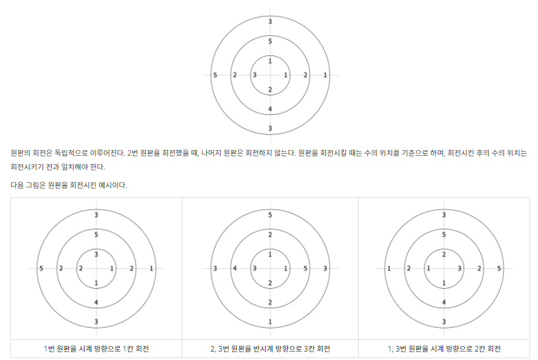
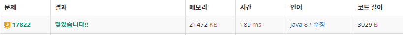

<br>

# ✔️ Problem  : [원판 돌리기](https://www.acmicpc.net/problem/17822)

<br>

<br>

------



-------

<br><br>

###### 💡 풀이 과정

**시뮬레이션 + BFS**

원판의 정보를 2차원 배열에 담아서 시뮬레이션을 진행하는 문제다

인접한 면에 같은 수를 찾는 부분이 있어서<span style="color:#2d3748;background-color:#fff5b1"> BFS</span>를 사용했다

다만, 같은 수를 찾고 0으로 만드는 부분이 있는데, 

<span style="color:#2d3748;background-color:#fff5b1">temp 배열</span>을 만들어서 결과 값을 담아 놓은 후 BFS가 끝났을 때 값을 바꿔줘야했다 <span style="color:red">→ 내가 주로 실수 많이 하는 부분이다</span>

temp 배열에 주어진 원판 정보를 복사할 때는 for문을 통해 모든 값을 확실히 복사해줘야 했다

<br>

-------------

**문제의 흐름**은 다음과 같다

1. 회전하기 : rotate
2. 인접하면서 같은 수 찾기 : find_adj
3. 인접한 수가 있으면 0 처리 : find_adj
3. 인접한 수가 없으면 밸런싱 : blalance_cal
3. T초 동안 1,2,3,4 반복  

```java
for(int t=1; t<=T;t++) {
	st= new StringTokenizer(br.readLine());
	int x= Integer.parseInt(st.nextToken());
	int dir= Integer.parseInt(st.nextToken());
	int K= Integer.parseInt(st.nextToken());

	//Simulation
	 for(int i=x;i<=N;i=i+x)
		 for(int k=0;k<K;k++)
			 rotate(i,dir);					 
		
	if(!find_adj()) balance_cal();
}
```

<br>

------

##### ▪ 회전하기

dir==0 시계 방향, dir==1 반시계 방향

```java
//회전하기
static void rotate(int i,int dir) {
	//시계
	if(dir==0) {
		int tmp=circle[i][M];
		for(int j=M-1;j>=1;j--)
			circle[i][j+1]=circle[i][j];
		circle[i][1]=tmp;
	}
	//반시계
	else if(dir==1) {
		int tmp=circle[i][1];
		for(int j=1;j<M;j++)
			circle[i][j]=circle[i][j+1];
		circle[i][M]=tmp;			
	}
}
```

<br>

-------------------

##### ▪ 인접하면서 같은 수 찾기

회전판 숫자 중 0이 아닌 숫자에 대해서 모두 탐색한다

BFS 도중 <span style="color:red">값이 섞이는 것을 방지</span>하기 위해 원판 정보를 **temp 배열**에 복사한 후 나중에 값을 바꿔준다

**4방 탐색**을 통해 인접한 면을 탐색한다

인접한 수를 찾고 지우는 과정까지 하면 true, 인접한 수를 찾지 못했으면 false를 반환

```java
//BFS로 인접하면서 같은 수 찾기
static boolean find_adj() {
	boolean isChange=false;
	Queue<CO> queue = new LinkedList<>();
	for(int i=1;i<=N;i++) {
		for(int j=1;j<=M;j++) {
			if(circle[i][j]>0) 
				queue.offer(new CO(i,j));
		}
	}
		
	int temp[][]=new int[N+1][M+1];
	for(int i=1;i<=N;i++) {
		for(int j=1;j<=M;j++)
			temp[i][j]=circle[i][j];
	}
		
	while(!queue.isEmpty()) {
		CO cur = queue.poll();
		for(int d=0;d<4;d++) {
			int nx=cur.x+dx[d];
			int ny=cur.y+dy[d];
			
			if(nx==M+1) nx=1;
			if(nx==0) nx=M;
			if(nx<1||nx>M||ny<1||ny>N) continue;				
				
			if(circle[ny][nx]==circle[cur.y][cur.x]) {
				temp[ny][nx]=0;
				temp[cur.y][cur.x]=0;
				isChange=true;
			}
		}
	}
	circle=temp;
	return isChange;
}
```

<br>

-----------

##### ▪ 회전판 밸런싱

인접한 부분을 찾지 못했을 때 회전판 숫자 밸런싱을 한다

회전판 숫자 평균을 구한 후, 평균보다 큰 숫자는 -1, 작은 숫자는 +1을 해준다

```java
//balancing
static void balance_cal() {
	int sum=0;
	int cnt=0;
	for(int i=1;i<=N;i++) {
		for(int j=1;j<=M;j++) {
			if(circle[i][j]>0) {
				sum+=circle[i][j];
				cnt++;
			}
		}
    }
	double avg=(double)sum/cnt;
		
	for(int i=1;i<=N;i++) {
		for(int j=1;j<=M;j++) {
			if(circle[i][j]<=0) continue;
			if(circle[i][j]>avg) circle[i][j]--;
			else if(circle[i][j]<avg) circle[i][j]++;
		}
	}
}
```

<br>

--------------------

##### ▪ 결과


<br><br>

###### 📃 코드(java 8)

```java
import java.io.BufferedReader;
import java.io.IOException;
import java.io.InputStreamReader;
import java.util.LinkedList;
import java.util.Queue;
import java.util.StringTokenizer;

public class BOJ_17822_원판돌리기 {
	static int N,M,T;
	static int circle[][];
	static int dx[]= {1,-1,0,0};
	static int dy[]= {0,0,1,-1};
	static int ans;
	
	static class CO{
		int y,x;
		public CO(int y, int x) {
			super();
			this.y = y;
			this.x = x;
		}
	}
	
	public static void main(String[] args) throws IOException {
		BufferedReader br= new BufferedReader(new InputStreamReader(System.in));
		StringTokenizer st = new StringTokenizer(br.readLine());
		N= Integer.parseInt(st.nextToken());
		M= Integer.parseInt(st.nextToken());
		T= Integer.parseInt(st.nextToken());
		
		//회전판 정보 입력
		circle= new int[N+1][M+1];
		for(int i=1;i<=N;i++) {
			st = new StringTokenizer(br.readLine());
			for(int j=1;j<=M;j++) 
				circle[i][j]=Integer.parseInt(st.nextToken());
		}

		//회전 조건 입력 + 시뮬레이션
		for(int t=1; t<=T;t++) {
			st= new StringTokenizer(br.readLine());
			int x= Integer.parseInt(st.nextToken());
			int dir= Integer.parseInt(st.nextToken());
			int K= Integer.parseInt(st.nextToken());
	
			//Simulation
			 for(int i=x;i<=N;i=i+x)
				 for(int k=0;k<K;k++)
					 rotate(i,dir);					 
			
			if(!find_adj()) balance_cal();
		}
		
		//답 구하기
		for(int i=1;i<=N;i++) 
			for(int j=1;j<=M;j++) 
				if(circle[i][j]>0) 
					ans+=circle[i][j];
		
		System.out.println(ans);
	}
	
	//회전하기
	static void rotate(int i,int dir) {
		//시계
		if(dir==0) {
			int tmp=circle[i][M];
			for(int j=M-1;j>=1;j--)
				circle[i][j+1]=circle[i][j];
			circle[i][1]=tmp;
		}
		//반시계
		else if(dir==1) {
			int tmp=circle[i][1];
			for(int j=1;j<M;j++)
				circle[i][j]=circle[i][j+1];
			circle[i][M]=tmp;			
		}
	}
	
	//BFS로 인접하면서 같은 수 찾기
	static boolean find_adj() {
		boolean isChange=false;
		Queue<CO> queue = new LinkedList<>();
		for(int i=1;i<=N;i++) {
			for(int j=1;j<=M;j++) {
				if(circle[i][j]>0) 
					queue.offer(new CO(i,j));
			}
		}
		
		int temp[][]=new int[N+1][M+1];
		for(int i=1;i<=N;i++) {
			for(int j=1;j<=M;j++)
				temp[i][j]=circle[i][j];
		}
		
		while(!queue.isEmpty()) {
			CO cur = queue.poll();
			for(int d=0;d<4;d++) {
				int nx=cur.x+dx[d];
				int ny=cur.y+dy[d];
				
				if(nx==M+1) nx=1;
				if(nx==0) nx=M;
				if(nx<1||nx>M||ny<1||ny>N) continue;				
				
				if(circle[ny][nx]==circle[cur.y][cur.x]) {
					temp[ny][nx]=0;
					temp[cur.y][cur.x]=0;
					isChange=true;
				}
			}
		}
		circle=temp;
		return isChange;
	}
	
	//balancing
	static void balance_cal() {
		int sum=0;
		int cnt=0;
		for(int i=1;i<=N;i++) {
			for(int j=1;j<=M;j++) {
				if(circle[i][j]>0) {
					sum+=circle[i][j];
					cnt++;
				}
			}
		}
		double avg=(double)sum/cnt;
		
		for(int i=1;i<=N;i++) {
			for(int j=1;j<=M;j++) {
				if(circle[i][j]<=0) continue;
				if(circle[i][j]>avg) circle[i][j]--;
				else if(circle[i][j]<avg) circle[i][j]++;
			}
		}
	}
	
}
```

