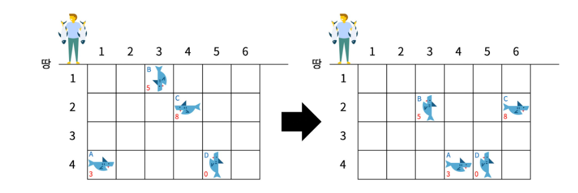
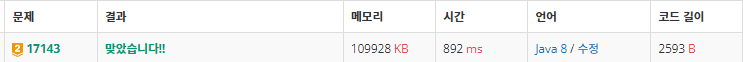

<br>

# ✔️ Problem  : [낚시왕](https://www.acmicpc.net/problem/17143)

<br>

<br>



-------

<br><br>

###### 💡 풀이 과정

<br>

**시뮬레이션 + BFS + DFS**

-------

낚시꾼이 이동하고, 상어를 잡고, 상어가 이동하고... 시뮬레이션 문제이다!

상어 객체 생성 후 2차원 배열에 상어 정보를 담고

상어를 잡는 부분에서는 **DFS**를, 상어 이동 부분에서는 **BFS**를 사용하여 풀이했다

<br>

----------------

**문제 흐름**은 다음과 같다

1. 낚시꾼 오른쪽으로 1칸 이동
2. 가장 가까운 상어 사냥
2. 남은 상어들 이동
3. 낚시꾼이 낚시터를 벗어날 때까지 1,2,3 반복

```java
for (int i = 1; i <= C; i++) {		
	shark_catch(i,0);
	shark_move();
}
```

<br>

---------

##### ▪  상어 사냥

낚시꾼 정면에 있는 상어를 잡는다

**<span style="color:#2d3748;background-color:#fff5b1">DFS</span>**를 사용하여 가장 가까운 상어를 찾고, 그 상어를 잡는다

```java
static void shark_catch(int x, int y) {
	if (y == R) return;

	if (map[y+1][x]!=null) {
		sum += map[y+1][x].size;
		map[y+1][x]=null;
		return;
	}
	shark_catch(x, y + 1);
}
```

<br>

------

##### ▪ 상어 이동

상어를 모두 이동 시킨 후, 같은 칸에 상어가 2마리 이상일 때, 크기가 큰 상어가 나머지 상어를 잡아먹는다

<span style="color:#2d3748;background-color:#fff5b1">**BFS**</span>를 이용했고, <span style="color:#2d3748;background-color:#fff5b1">temp 배열</span>을 선언해서 BFS 도중 값이 섞이는 것을 방지했다

<br>

1.**낚시터에 있는 모든 상어들을 queue에 담기** 

```java
static void shark_move() {
		Queue<Shark> queue = new LinkedList<>(); 
		for(int i = 1; i <= R; i++) {
			for(int j = 1; j <= C; j++) {
				if(map[i][j] != null) {
					queue.offer(new Shark(i, j, map[i][j].speed, map[i][j].dir, map[i][j].size));
				}
			}
		}
	
```

-----------

2.**queue에서 상어들을 꺼내 이동하기**

여기서, 입력받은 속도를 그대로 사용해서 for문을 돌리면 **<span style="color:red">시간 초과</span>**가 났다

속도를 **맵 크기 만큼 나누고** 그 나머지를 이용하여 불필요한 연산이 최소화되며 pass 되었다

		Shark temp[][]=new Shark[R+1][C+1];
		while(!queue.isEmpty()) {
			Shark cur=queue.poll();
			
			int nx=cur.x;
			int ny=cur.y;
			int dir=cur.dir;
			int speed=cur.speed;
			if(dir==1||dir==2) speed=speed%(2*(R-1));
			if(dir==3||dir==4) speed=speed%(2*(C-1));
			
			for(int j=1;j<=speed;j++) {
				if(nx+dx[dir]>C||ny+dy[dir]<1) dir++;
				
				if(ny+dy[dir]>R||nx+dx[dir]<1) dir--;
				
				nx+=dx[dir];
				ny+=dy[dir];
			}

---

3.**이동 후 상어가 2마리 이상인 경우, 크기가 큰 상어를 남기기**

		if(temp[ny][nx] !=null) {
			if(temp[ny][nx].size<cur.size) {				
				temp[ny][nx]=new Shark(ny,nx,cur.speed,dir,cur.size);
			}
		}
		else 
			temp[ny][nx]=new Shark(ny,nx,cur.speed,dir,cur.size);
	}
	
	map=temp;
<br>

<br>

###### 🌈 결과


<br><br>

###### 📃 코드(java 8)

```java
import java.io.BufferedReader;
import java.io.IOException;
import java.io.InputStreamReader;
import java.util.LinkedList;
import java.util.Queue;
import java.util.StringTokenizer;

public class Main {
	static int R, C, M;
	static Shark map[][];
	static int dx[] = { 0, 0, 0, 1, -1 }; // 위 아래 오른 왼
	static int dy[] = { 0, -1, 1, 0, 0 };
	static int sum;

	static class Shark {
		int x,y;
		int speed, dir, size;

		public Shark(int y, int x, int speed, int dir, int size) {
			super();
			this.x = x;
			this.y = y;
			this.speed = speed;
			this.dir = dir;
			this.size = size;
		}
	}
	

	public static void main(String[] args) throws IOException {
		BufferedReader br = new BufferedReader(new InputStreamReader(System.in));
		StringTokenizer st = new StringTokenizer(br.readLine());
	
		R = Integer.parseInt(st.nextToken());
		C = Integer.parseInt(st.nextToken());
		M = Integer.parseInt(st.nextToken());
		
		if(M==0) {
			System.out.println(0);
			return;
		}

		map = new Shark[R + 1][C + 1];
		
		for (int i = 1; i <= M; i++) {
			st = new StringTokenizer(br.readLine());
			int r = Integer.parseInt(st.nextToken());
			int c = Integer.parseInt(st.nextToken());
			int s = Integer.parseInt(st.nextToken());
			int d = Integer.parseInt(st.nextToken());
			int z = Integer.parseInt(st.nextToken());
			map[r][c]=new Shark(r,c,s,d,z);
		}
		
		for (int i = 1; i <= C; i++) {		
			shark_catch(i,0);
			shark_move();
		}
		
		System.out.println(sum);
	}

	static void shark_catch(int x, int y) {
		if (y == R)
			return;

		if (map[y+1][x]!=null) {
			sum += map[y+1][x].size;
			map[y+1][x]=null;
			return;
		}
		shark_catch(x, y + 1);
	}
	
	static void shark_move() {
		Queue<Shark> queue = new LinkedList<>(); 
		for(int i = 1; i <= R; i++) {
			for(int j = 1; j <= C; j++) {
				if(map[i][j] != null) {
					queue.offer(new Shark(i, j, map[i][j].speed, map[i][j].dir, map[i][j].size));
				}
			}
		}
		
		Shark temp[][]=new Shark[R+1][C+1];
		
		while(!queue.isEmpty()) {
			Shark cur=queue.poll();
			
			int nx=cur.x;
			int ny=cur.y;
			int dir=cur.dir;
			int speed=cur.speed;
			if(dir==1||dir==2) speed=speed%(2*(R-1));
			if(dir==3||dir==4) speed=speed%(2*(C-1));
			
			for(int j=1;j<=speed;j++) {
				if(nx+dx[dir]>C||ny+dy[dir]<1) dir++;
				
				if(ny+dy[dir]>R||nx+dx[dir]<1) dir--;
				
				nx+=dx[dir];
				ny+=dy[dir];
			}
			
			if(temp[ny][nx] !=null) {
				if(temp[ny][nx].size<cur.size) {				
					temp[ny][nx]=new Shark(ny,nx,cur.speed,dir,cur.size);
				}
			}
			else 
				temp[ny][nx]=new Shark(ny,nx,cur.speed,dir,cur.size);
		}
		
		map=temp;
	}

}

```

