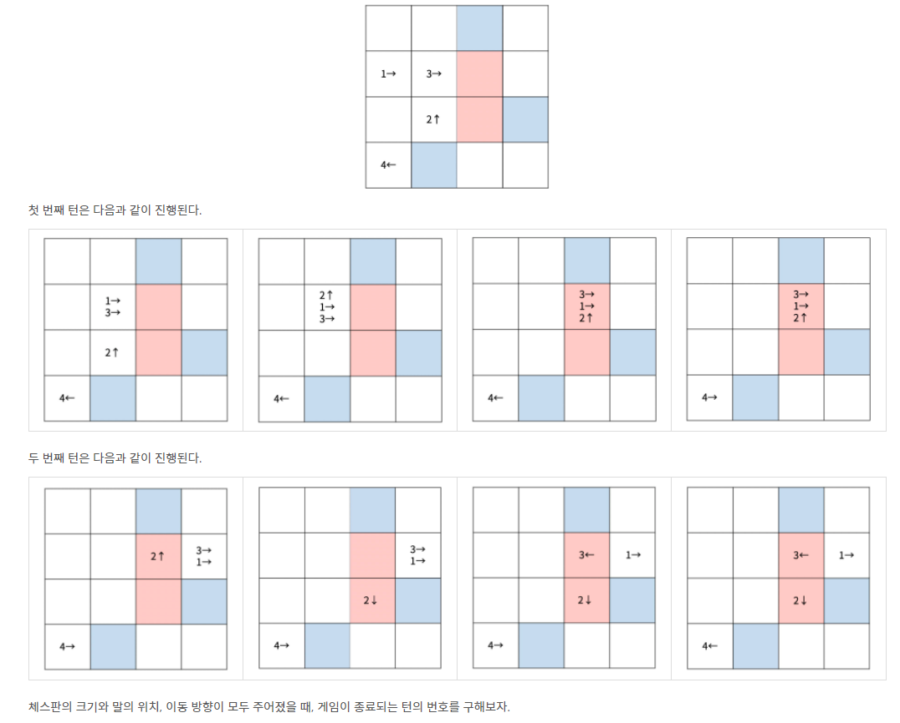

<br>

# ✔️ Problem  : [새로운 게임2](https://www.acmicpc.net/problem/17837)

<br>

<br>



-------

<br><br>

###### 💡 풀이 과정

**시뮬레이션**

최대 1000번의 턴동안 주어진 조건에 따라 체스 말이 움직이는데, 이동 칸의 색깔(흰 칸, 파란 칸, 빨간 칸)에 따라 다르게 처리하고 4개 이상의 말이 한 칸에 쌓였을  때 return 후 turn을 출력하는 문제다

-------------

이 문제를 통해 부족함을 또 다시 한번 느꼈다. 잔실수가 너무 많다.

고정 값으로 두고 처리해야하는 부분을 고려하지 않고 cur.x, cur.y 값을 바로 이용하여 장시간 고통 받았다.

조금 더 꼼꼼하고 섬세하게!

<br>

----------------

**문제 흐름**은 다음과 같다

1. 체스 이동정보를 입력 받기
2. 한 턴에 체스 말부터 마지막 말까지 이동, 최대 1000턴 진행
2. 이동할 칸이 흰 칸이면 queue 형식(정순)으로 말 이동, 흰 칸이면 stack 형식(역순)으로 이동, 파란 칸& 범위 밖 지역이면 방향 변경
3. 턴을 진행한 후 말이 4개 이상 쌓이는 칸이 발생하면 return 후 결과 출력

```java
ans=-1;
while (turn++<=1000) {
	if(play()) {
		ans=turn;
		break;
	}
}
```

<br>

---------

##### ▪ 말 이동

한 턴 동안 1번 말부터 모든 말 순서대로 이동

여기서, cx, cy 변수 선언하고 고정시킬 값 담아두기! <span style="color:red">(자주하는 실수)</span>

```java
for (int i = 1; i <= K; i++) {
	CO cur = horse[i];
	int cx=cur.x;
	int cy=cur.y;
	int size = map[cy][cx].size();
	int nx = cx + dx[cur.dir];
	int ny = cy + dy[cur.dir];
```

<br>

------

##### ▪ 파란 칸 & 범위 밖

파란 칸 or 범위 밖 영역에 대해서 방향을 바꿈 (2번 이상이면 stop)

```java
//파란 칸(2) + 범위 외 지역
if (nx<=0||ny<=0||nx>N||ny>N ||color[ny][nx] == 2) {	
	cur.dir=change_dir(cur.dir);
	nx = cx + dx[cur.dir];
	ny = cy + dy[cur.dir];	
	if ((nx <= 0 || ny <= 0 || nx > N || ny > N) || color[ny][nx] == 2) continue;
}
```

<br>

-------------------

##### ▪ 흰 칸 & 빨간 칸

흰 칸 :  해당 되는 말의 순서를 찾은 후 그 위로 쌓인 말을 모두 이동 (queue )

빨간 칸 : 그 위로 쌓인 말 순서를 반대로 바꾼 후 모두 이동 (stack)

```java
//흰색+빨간색 칸
//순서 찾기(몇번째 쌓여 있는지)
int start = -1;
for (int j = 0; j < size; j++) {
	if (map[cur.y][cur.x].get(j) == i) {
			start = j;
	}
}
if(start==-1) continue;

//흰색 칸(0) (정순)
if (color[ny][nx] == 0) {
	for (int j = start; j < size; j++) {
		map[ny][nx].add(map[cy][cx].get(j));
		horse[map[cy][cx].get(j)].x=nx;
		horse[map[cy][cx].get(j)].y=ny;
	}
}
//빨간 칸(1) (역순)
if (color[ny][nx] == 1) {
	for (int j = size - 1; j >= start; j--) {
		map[ny][nx].add(map[cy][cx].get(j));
		horse[map[cy][cx].get(j)].x=nx;
		horse[map[cy][cx].get(j)].y=ny;
	}
}
//이동한 말 삭제
for (int j = start; j < size; j++) 
map[cy][cx].remove(start);
```

<br>

-------------------

##### ▪ return

한 칸에 말이 4개 이상 쌓이면 return 후 몇 번째 turn인지 출력한다

```java
//말이 4개이상 쌓이면 return
if(map[ny][nx].size()>=4) 
	return true;
```

<br>


----------

##### ▪ 방향 바꾸기

switch 문을 통해서 방향 바꾸기

```java
//방향 바꾸기
public static int change_dir(int dir) {
	switch(dir) {
		case 1: return 2;
		case 2: return 1;
		case 3: return 4;
		case 4: return 3;
	}
    return -1;
}
```

<br>

--------------------

##### ▪ 결과


<br><br>

###### 📃 코드(java 8)

```java
import java.io.BufferedReader;
import java.io.IOException;
import java.io.InputStreamReader;
import java.util.ArrayList;
import java.util.StringTokenizer;

public class BOJ_17837_새로운게임2 {
	static int N, K;
	static ArrayList<Integer> map[][];
	static int color[][];
	static CO[] horse;
	static int[] dx = { 0, 1, -1, 0, 0 };
	static int[] dy = { 0, 0, 0, -1, 1 };
	static int turn,ans;

	static class CO {
		int y, x, dir;
		public CO(int y, int x, int dir) {
			super();
			this.y = y;
			this.x = x;
			this.dir = dir;
		}
	}

	public static void main(String[] args) throws IOException {
		BufferedReader br = new BufferedReader(new InputStreamReader(System.in));
		StringTokenizer st = new StringTokenizer(br.readLine());
		N = Integer.parseInt(st.nextToken());
		K = Integer.parseInt(st.nextToken());
		
		//map 초기화(말 저장할 곳)
		map = new ArrayList[N+1][N+1];
		for(int i=1;i<=N;i++) {
			for(int j=1;j<=N;j++)
				map[i][j] = new ArrayList<>();
		}

		//색깔 판 초기화
		color = new int[N + 1][N + 1];
		for (int i = 1; i <= N; i++) {
			st = new StringTokenizer(br.readLine());
			for (int j = 1; j <= N; j++)
				color[i][j] = Integer.parseInt(st.nextToken());
		}

		//말 저장
		horse = new CO[K+1];
		for (int k = 1; k <= K; k++) {
			st = new StringTokenizer(br.readLine());
			int y = Integer.parseInt(st.nextToken());
			int x = Integer.parseInt(st.nextToken());
			int d = Integer.parseInt(st.nextToken());
			horse[k]=new CO(y, x, d);
			map[y][x].add(k);
		}
		
		
		ans=-1;
		while (turn++<=1000) {
			if(play()) {
				ans=turn;
				break;
			}
		}
		System.out.println(ans);		

	}

	static boolean play() {
		for (int i = 1; i <= K; i++) {
			CO cur = horse[i];
			int cx=cur.x;
			int cy=cur.y;
			int size = map[cy][cx].size();
			int nx = cx + dx[cur.dir];
			int ny = cy + dy[cur.dir];
			
			//파란 칸(2) + 범위 외 지역
			if (nx<=0||ny<=0||nx>N||ny>N ||color[ny][nx] == 2) {	
				cur.dir=change_dir(cur.dir);
				nx = cx + dx[cur.dir];
				ny = cy + dy[cur.dir];	
				if ((nx <= 0 || ny <= 0 || nx > N || ny > N) || color[ny][nx] == 2) continue;
			}
			
			
			//흰색+빨간색 칸
			//순서 찾기(몇번째 쌓여 있는지)
			int start = -1;
			for (int j = 0; j < size; j++) {
				if (map[cur.y][cur.x].get(j) == i) {
					start = j;
				}
			}
			if(start==-1) continue;

			//흰색 칸(0) (정순)
			if (color[ny][nx] == 0) {
				for (int j = start; j < size; j++) {
					map[ny][nx].add(map[cy][cx].get(j));
					horse[map[cy][cx].get(j)].x=nx;
					horse[map[cy][cx].get(j)].y=ny;
				}
			} 
			//빨간 칸(1) (역순)
			if (color[ny][nx] == 1) {
				for (int j = size - 1; j >= start; j--) {
					map[ny][nx].add(map[cy][cx].get(j));
					horse[map[cy][cx].get(j)].x=nx;
					horse[map[cy][cx].get(j)].y=ny;
				}
			}
			
			//이동한 말 삭제
			for (int j = start; j < size; j++) 
				map[cy][cx].remove(start);
			
			//말이 4개이상 쌓이면 return
			if(map[ny][nx].size()>=4) 
				return true;
			
		}
		return false;
	}
	
	//방향 바꾸기
    public static int change_dir(int dir) {
        switch(dir) {
        	case 1: return 2;
        	case 2: return 1;
        	case 3: return 4;
        	case 4: return 3;
        }
        return -1;
    }

}

```

