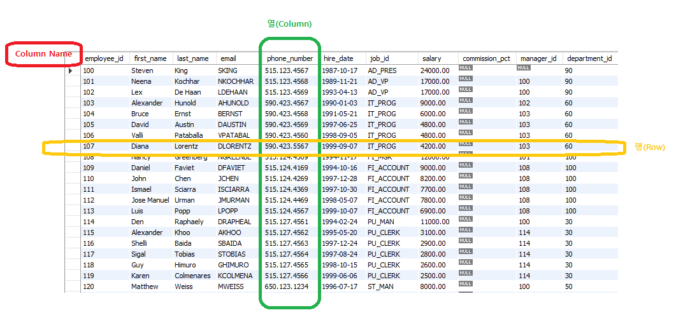
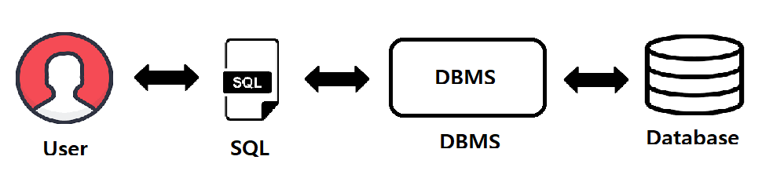

 

## RDBMS?

- 관계형(relational) 데이터베이스 시스템

- 테이블 기반의 DBMS

  - 데이터를 테이블 단위로 관리

    -하나의 테이블은 여러개의 칼럼으로 구성

  - 중복 데이터를 최소화시킴

    -같은 데이터가 여러 칼럼 또는 테이블에 존재했을 경우, 데이터를 수정시 문제가 발생할 가능성이 높아짐. - 정규화

- 여러 테이블에 분산되어 있는 데이터를 검색 시 테이블 간의 관계를 이용하여 필요한 데이터를 검색

 

## SQL(Structured Query Language)

- Database에 있는 정보를 사용할 수 있도록 지원하는 언어.

- 모든 DBMS에서 사용가능

- 대소문자는 구별하지 않음(단, 데이터의 대소문자는 구분) 

  (mariadb ,mysql는 데이터의 대소문자도 구분 못함) -> binary()를 해주면 된다!

- SQL 구문은 DCL, DDL, DML로 구분한다.

1.  데이터 조작어 (DML : Data Manipulation Language) : INSERT(C), SELECT(R), UPDATE(U), DELETE(D)
   - Data 조작기능 (CRUD)
2.  데이터 정의어 (DDL : Data Definition Language) : CREATE, DROP, ALTER, RENAME
   - 데이터베이스 객체의 구조를 정의(테이블 생성,칼럼 추가, 타입변경 등)
3.  데이터 제어어 (DCL :  Data Control Language) : GRANT, REVOKE
   - DB, Table의 접근권한이나 CRUD 권한을 정의
4.  트랜젝션제어 (TCL : Transaction Control Language) : COMMIT, ROLLBACK, SAVEPOINT

   