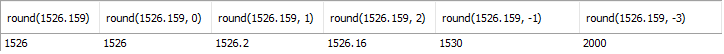
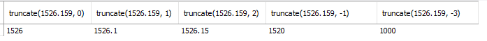
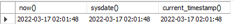
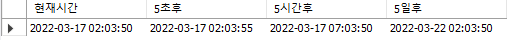
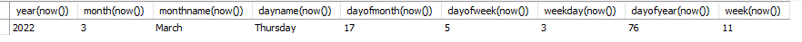
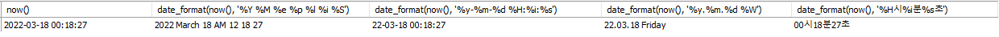

<br>

### ✅ 내장 함수

- 숫자함수 : mod(나머지), round(반올림), trunc(내림), ceil(올림) , truncate(숫자를 기준으로 버림),,, etc

- 문자함수 : lower, upper, length, substr, ltrim, rtrim, trim,,, etc

<br>

##### **▪** <span style="color:darkblue">abs </span>절대값 

``` sql
select abs(-5), abs(0), abs(+5)
from dual;
```

<br>

##### **▪** <span style="color:darkblue">ceil</span> 올림

``` sql
select ceil(12.2), ceiling(12.2), ceil(-12.2), ceiling(-12.2)
from dual;
```

<br>

##### **▪** <span style="color:darkblue"> floor</span> 내림

``` sql
select floor(12.6), floor(-12.2)
from dual;
```

<br>

##### **▪** <span style="color:darkblue"> round</span> 반올림

``` sql
select round(1526.159), round(1526.159, 0), round(1526.159, 1), 
round(1526.159, 2), round(1526.159, -1), round(1526.159, -3)
from dual;
```



<br>

##### **▪** <span style="color:darkblue"> truncate</span> 버림

``` sql
select truncate(1526.159, 0), truncate(1526.159, 1), truncate(1526.159, 2), 
truncate(1526.159, -1), truncate(1526.159, -3)
from dual;
```



<br>

##### **▪** <span style="color:darkblue"> mod, %</span> 나머지 구하기

``` sql
select mod(8, 3), 8 % 3
from dual;
```

<br>

##### **▪** <span style="color:darkblue"> pow</span> 거듭제곱 구하기

``` sql
select pow(2,3), power(2,3)
from dual;
```

<br>

##### **▪** <span style="color:darkblue"> greatest / least </span>최댓값 / 최솟값

``` sql
select greatest(4, 3, 7, 5, 9), least(4, 3, 7, 5, 9)
from dual;
```

<br>

##### **▪** <span style="color:darkblue">ASCII 코드</span>

``` sql
select ASCII('0'), ASCII('A'), ASCII('a')
from dual;
```

<br>

##### **▪** <span style="color:darkblue"> insert</span> 삽입

```sql
-- 결과 : hello ssafy !!!
select insert('helloabc!!!', 6, 3, ' ssafy ')
from dual;
```

<br>

##### **▪** <span style="color:darkblue"> replace </span>교환

``` sql
-- 결과 : hello ssafy !!!
select replace('helloabc!!!', 'abc', ' ssafy ')
from dual;
```

<br>

##### **▪** <span style="color:darkblue"> instr</span> 문자열의 위치

``` sql
-- 결과 : 7
select instr('hello ssafy !!!', 'ssafy')
from dual;
```

<br>

##### **▪** <span style="color:darkblue"> mid, substring</span> 특정 위치부터 갯수만큼 리턴

``` sql
-- 결과 : ssafy / ssafy
select mid('hello ssafy !!!', 7, 5), substring('hello ssafy !!!', 7, 5)
from dual;
```

<br>

##### **▪** <span style="color:darkblue"> reverse</span> 반대로 나열

```sql
-- 결과 : hello ssafy !!!
select reverse('!!! yfass olleh')
from dual;
```

<br>

##### **▪** <span style="color:darkblue">Upper</span>

문자열을 대문자로

```sql
-- 문자열을 대문자로
select * from employees
where upper(last_name)='KING';  
```

<br>

##### **▪** <span style="color:darkblue">Lower</span>

문자열을 소문자로

```sql
-- 문자열을 소문자로
select * from employees
where lower(last_name)='king';  
```

<br>

##### **▪** <span style="color:darkblue">left, right</span> 왼쪽, 오른쪽에서 갯수만큼 추출 

``` sql
-- 결과 : hello  /   fy !!!
select left('hello ssafy !!!', 5), right('hello ssafy !!!', 6)
from dual;
```

<br>

##### **▪** <span style="color:darkblue">count, sum, avg, max, min</span>

``` sql
-- 사원의 총수, 급여의 합, 급여의 평균, 최고급여, 최저급여
select count(employee_id), sum(salary), avg(salary), max(salary), min(salary)
from employees;
```

<br>

##### **▪** <span style="color:darkblue">if null 문</span>

``` sql
-- if(논리식, 값1, 값2) 논리식-> true: 값1, false : 값2
-- ifnull(값1, 값2) 값1 == NULL : 값2,  값1 != NULL : 값1
-- nullif(값1, 값2) 값1 = 값2 -> true: NULL / false : 값1
select if(3 > 2, '크다', '작다'), if(3 > 5, '크다', '작다'),
		ifnull(null, 'b'), ifnull('a', 'b')
		nullif(3, 3), nullif(3, 5),
from dual;
```

<br>

##### **▪** <span style="color:darkblue">시간 함수</span>

``` sql
-- 현재 시간
select now(), sysdate(), current_timestamp()
from dual;
```



<br>

``` sql
-- 현재 날짜(년월일) / 현재 날짜(년월일) / 현재 시간(시분초) /현재 시간(시분초)
select curdate(), current_date(), curtime(), current_time()
from dual;
```


<br>

``` sql
select now() 현재시간, 
date_add(now(), interval 5 second) 5초후,
date_add(now(), interval 5 hour) 5시간후, 
date_add(now(), interval 5 day) 5일후
from dual;
```



<br>

``` sql
-- dayofweek() : 일월화수목금토(1234567) 중
-- weekday(): 월화수목금토일(0123456) 중
-- dayofyear() :365 중 오늘이 몇번째날?
-- dayofyear : 52주 중 몇번째 주? (첫번째 주:0으로 시작)
select year(now()), month(now()), monthname(now()), 
dayname(now()), dayofmonth(now()), dayofweek(now()), 
weekday(now()), dayofyear(now()), week(now())
from dual;
```



<br>

``` sql
select now(), 
date_format(now(), '%Y %M %e %p %l %i %S'),
date_format(now(), '%y-%m-%d %H:%i:%s'),
date_format(now(), '%y.%m.%d %W'), 
date_format(now(), '%H시%i분%s초')
from dual;
```


