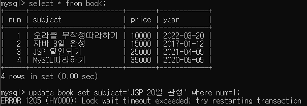

<br>

Source Link : [InlineView Subquery](https://github.com/Jaehwany/Database/blob/036dc94a641e1156a4abbb18f3fbbba3a5cc7168/3.%20Subquery/2.%20Subquery_InlineView(from)/Inlineview_Subquery.sql)

<br>

### ✔ 트랜잭션, Transaction

------------------------------------------------------------------

- 트랜잭션이란, 데이터베이스의 상태를 변경시키기 위해 수행하는 작업 단위
- SELECT, UPDATE, INSERT, DELETE 와 같은 행동을 뜻함

<br>

### ✔ 트랜잭션의 특징

-----------------------------------------------

- 원자성 : 트랜잭션이 **DB에 모두 반영되거나, 전혀 반영되지 않음**를 뜻한다.
- 일관성 : 트랜잭션 **처리의 결과가 항상 일관되어야 한다**
- 독립성 : **하나의 트랜잭션은 다른 트랜잭션에 끼어들 수 없는 독립성**을 가진다
- 지속성 : **트랜잭션이 성공적으로 완료되면 영구적으로 결과에 반영**되어야 한다

<br>

### ✔ Commit, Rollback 

------------------------------------------------------------------

- commit : 일의 시작과 끝이 완벽하게 마무리가 되면 테이블에 적용 (일관성 있는 상태)
- rollback : 처리도중 인터럽트(interrupt:장애)가 발생하면 되돌아옴(원자성이 깨진 상태)

``` sql
use ssafydb;

create table book(
	num int primary key auto_increment,
	subject varchar(50),
	price int,
	year date
);

-- ex2) 데이터 추가
-- 오라클 무작정 따라하기, 10000, 오늘날짜
-- 자바 3일 완성,15000, 2019-01-12
-- JSP 달인되기,25000, 2021-04-05
-- 자동 커밋해제: set autocommit=0; / 자동 커밋설정: set autocommit=1;
set autocommit=0;
insert into book(subject,price,year) values('오라클 무작정따라하기',10000, now());
insert into book(subject,price,year) values('자바 3일 완성',15000, '2017-01-12');
insert into book(subject,price,year) values('JSP 달인되기',25000,'2021-04-05');
insert into book(subject,price,year) values('MySQL따라하기',35000,'2020-05-05');
commit;
select * from book;
```

<br>

- 트랜젝션 처리를 안했을 경우 오류 상황

``` sql
-- 콘솔창에서
update book set subject='JSP 20일 완성' where num=1;

-- 이클립스창 또는  MySQL Workbench에서
update book set subject='JSP 마스터북' where num=1;
```




- 트랜젝션 처리를 했을 경우

``` sql
set autocommit=1;
-- 콘솔창에서
update book set subject='JSP 20일 완성' where num=1;

-- 이클립스창 또는  MySQL Workbench에서
update book set subject='JSP 마스터북' where num=1;
```


