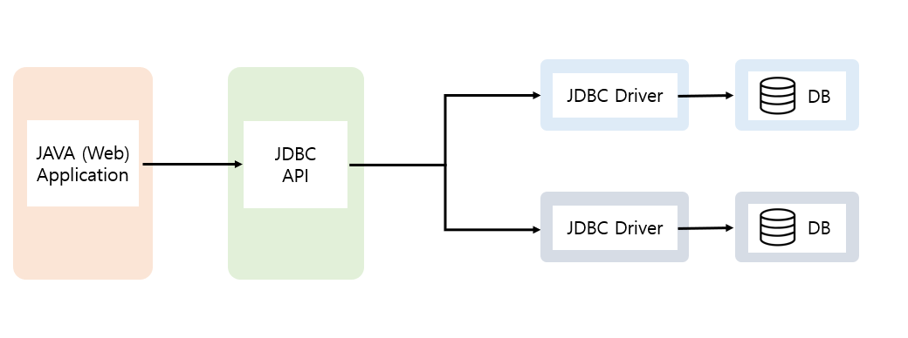

<br>

###### ✔ JDBC

- Java DataBase Connectivity
- 자바 프로그래밍 언어로 만들어진 SQL문을 실행할 수 있는 함수 호출 인터페이스



<br>

###### ✔ JDBC 특징

- DBMS 종류에 관계없이 독립적인 자바 프로그래밍
- DB가 달라지더라도 동일한 API 사용 가능하다 (드라이버 및 URL만 수정)

<br>

###### ✔ JDBC 기능

- DB 연결 설정
- SQL 문장을 DBMS에 전송
- SQL 문장 전송 후 결과를 처리할 수 있게 해준다

<br>

###### ✔ JDBC API : java.sql package

----------------

- **Driver (interface)**
  - JDBC 드라이버가 반드시 구현해야 하는 인터페이스
  - 드라이버 버전이나 연결에 대한 정보를 알아볼 수 있는 메소드를 가지고 있다

-----------------

- **Connection (interface)**
  - DB에 대한 Session을 표현한다
    - Session은 Client가 Server에 요청하기 위해 연결을 맺은 상태
  - DriverManager의 getConnection() 메소드를 이용하여 얻어 올 수 있다
  - default :  setAutoCommit(true)로 설정
  - commit을 해주고 싶거나 RollBack 처리를 하고자 할 경우에는 setAutoCommit(false)로 설정

----------------------------

- <span style ="background-color:#fff5b1">**Statement (interface)**</span>

  - SQL 문장을 실행하고 그것에 대한 결과 값을 가져오기 위해 사용

  ``` java
  public boolean execute(String sql) throws SQLException;
  
  public ResultSet executeQuery(String sql) throws SQLException;
  
  public int executeUpdate(String sql) throws SQLException;
  ```

<br>

-------------------------

- <span style ="background-color:#fff5b1">**PreparedStatement (interface)**</span>

  - 동일한 SQL 문장이 반복 수행될 때 사용하는 객체
  - 대용량의 문자나 바이너리 타입의 데이터(이미지나 사운드 등)를 저장하기 위해서 사용
  - SQL 문장이 미리 컴파일 되어 PreparedStatement 객체에 저장
  - 반복 수행 시 clearParameters() 메소드를 이용해 Statement에 남겨진 값을 초기화 한다

  ``` java
  // Select를 처리할 때 사용
  public ResultSet executeQuery() throws SQLException;
  
  // DML(delete, update, insert)등의 SQL을 수행할 때 사용한다.
  public int executeUpdate() throws SQLException;
  ```

<br>

-------------------

- **CallableStatement (interface)**
  - DB에 대한 실제 SQL문을 실행하는 것이 아니라 Stored Procedures를 호출
  - Stored Procedures란 연속되는 SQL문으로, DB에 Stored Procedures를 만들어 두고 자바에서 호출하여 사용할 수 있게 한다
  - Stored Procedures 사용 시 속도의 향상을 기대할 수 있고, 자바 코드에 SQL문장이 들어가지 않으므로 자바 코드가 SQL에 독립적이 된다

<br>

-------------------------

- <span style ="background-color:#fff5b1">**ResultSet (interface)**</span>
  - Query에 대한 결과값 처리
  - ResultSet 객체의 커서는 첫번째 레코드보다 바로 이전을 가르킨다
  - next() :  ResultSet 객체의 커서를 이동
  - getXXX(index or name) 메소드를 이용하여 데이터를 얻을 수 있다
    - getString(index or name);
    - getInt(index or name);
    - getDate(index or name);

-------------------

