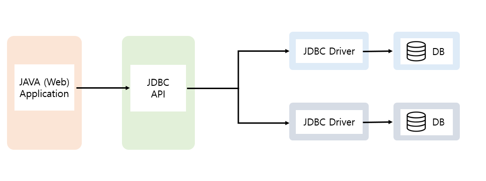
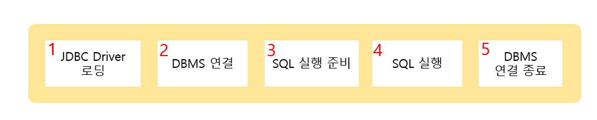

<br>

###### ✔ JDBC

- Java DataBase Connectivity
- 자바 프로그래밍 언어로 만들어진 SQL문을 실행할 수 있는 함수 호출 인터페이스



<br>

-------------------

###### ✔ JDBC 프로그래밍 개발 순서



------------

**1. JDBC Driver Loading** 

- DB 접속을 위해 애플리케이션의 JVM 안으로 특정 드라이버 클래스를 적재

- Class.forName( Driver ClassName )

- [MySQL] Driver Class : "com.mysql.cj.jdbc.Driver"

  ``` java
  private static final String DRIVER = "com.mysql.cj.jdbc.Driver";
  try {
  	Class.forName(DRIVER);
  	System.out.println("드라이버 로딩 성공!!");
  } catch (ClassNotFoundException e) {
  	e.printStackTrace();
  	System.out.println("드라이버 로딩 실패!!");
  }
  ```

  <br>

------------------------

**2. DBMS 연결 (Connection 생성)**

- DriverManager 클래스를 이용하여 URL형태로 주어진 데이터 베이스에 대한 접속 요청

- Connection conn = DriverManager.getConnection(URL, dbid, dbpassword);

- [MySQL] JDBC URL : jdbc:mysql://[HOST]:[PORT]/[DBNAME]?[param1=value1]&[param2=value2]&[..] 

  ``` java
  private static final String URL = "jdbc:mysql://localhost:3306/happyhouse?serverTimezone=UTC&useUniCode=yes&characterEncoding=UTF-8";
  private static final String DB_ID = "ssafy";
  private static final String DB_PASS = "ssafy";
  
  public static Connection getConnection() throws SQLException{
  	return DriverManager.getConnection(URL, DB_ID, DB_PASS);
  }
  ```

<br>

-------------

**3. SQL 실행 준비 (Statement, PreparedStatement 생성)**

- String sql = “insert, update, delete, select, …”;

- Statement 생성 :  Statement stmt = conn.createStatement();

- PreparedStatement 생성 : PreparedStatement pstmt = conn.prepareStatement(sql);

  ```java
  Connection conn = null;
  PreparedStatement pstmt = null;
  ResultSet rs = null;
  
  try {
  	conn = DBConnection.getConnection();
  	String sql = "select i.dongName, i.aptName, h.area,h.dealamount,h.dealYear,h.dealMonth,i.lat,i.lng ";
      sql += "from housedeal h, houseinfo i where h.aptCode=i.aptCode and dongName like ?";
  	
      pstmt = conn.prepareStatement(sql);
  ```


<br>

--------------

**4. SQL 실행 (executeUpdate, executeQuery)**

- Statement
  - Insert, Update, Delete :  int cnt = stmt.executeUpdate(sql);
  - Select :  ResultSet rs = stmt.executeQuery(sql);

- PreparedStatement
  - sql 문의 치환변수 값 설정 : pstmt.setXXX(index, val);
  - Insert, Update, Delete :  int cnt = pstmt.executeUpdate();
  - Select :  ResultSet rs = pstmt.executeQuery();
  
- ResultSet
  - ResultSet을 얻어온 후 rs.next()를 실행해야 한다
    - select의 결과가 반드시 하나가 나오는 경우. : rs.next();
    - select의 결과가 하나 또는 못 얻어 오는 경우. : if(rs.next) { }
    - select의 결과가 여러 개가 나올 수 있는 경우. : while(rs.next()) { }
  - 값 얻기
    - String str = rs.getString(index or name);
    - int cnt = rs.getInt(index or name);
  
  <br>
  
  ``` java
  try {
  	conn = DBConnection.getConnection();
  	String sql = "select i.dongName, i.aptName, h.area,h.dealamount,h.dealYear,h.dealMonth,i.lat,i.lng ";
      sql += "from housedeal h, houseinfo i where h.aptCode=i.aptCode and dongName like ?";
      pstmt = conn.prepareStatement(sql);
  	
      String names = dongName+'%';
  	pstmt.setString(1,names);
  	rs = pstmt.executeQuery();
      while (rs.next()) {
  		aptDto = new AptDto();
  		aptDto.setDongName(rs.getString("i.dongName"));
  		aptDto.setAptName(rs.getString("i.aptName"));
      }
  ```
  
  

<br>

----------------

**5. DBMS 연결 종료**

- 모든 작업 끝난 경우에 ResultSet, Statement, Connection 객체의 close() 메소드를 이용하여 작업을 종료한다. (연결 역순으로 종료)

- Connection은 상당한 Overhead를 가져온다. 따라서 최적화된 상태를 유지하기 위해서는 반드시 Connection을 닫아 주어야 한 다.
  - rs.close();
  - pstmt.close();
  - conn.close();
  
  <br>
  
  ``` java
  public static void close(Connection conn, PreparedStatement pstmt, ResultSet rs) {
  	try {
  		if(rs != null)
  			rs.close();
  		if(pstmt != null)
  			pstmt.close();
  		if(conn != null)
  			conn.close();
  	} catch (SQLException e) {
  		e.printStackTrace();
  	}
  }
  ```
  
  ``` java
  try {
  	conn = DBConnection.getConnection();
  	String sql = "select i.dongName, i.aptName, h.area,h.dealamount,h.dealYear,h.dealMonth,i.lat,i.lng ";
      sql += "from housedeal h, houseinfo i where h.aptCode=i.aptCode and dongName like ?";
      pstmt = conn.prepareStatement(sql);
  	
      String names = dongName+'%';
  	pstmt.setString(1,names);
  	rs = pstmt.executeQuery();
      while (rs.next()) {
  		aptDto = new AptDto();
  		aptDto.setDongName(rs.getString("i.dongName"));
  		aptDto.setAptName(rs.getString("i.aptName"));
      }
  } catch (SQLException e) {
      e.printStackTrace();
  } finally {
  	DBClose.close(conn, pstmt, rs);
  }
  ```
  
  